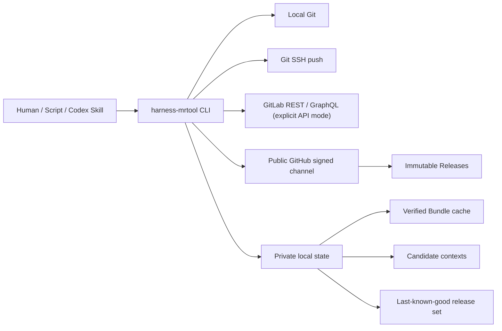
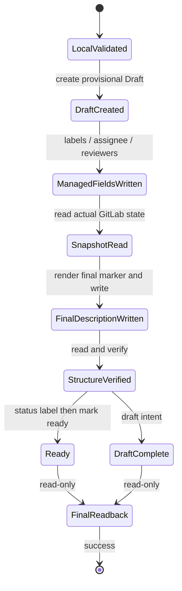

# Harness MR Tool 技术架构

| 项目 | 内容 |
| --- | --- |
| 文档编号 | HMR-ARCH-001 |
| 对应需求 | HMR-REQ-001 v0.3.0 |
| 架构版本 | v0.1.0 |
| 状态 | Reviewing |
| 目标平台 | Windows x64 |
| 实现语言 | TypeScript 5.9.3 |
| 运行封装 | Node.js 24.16.0 Single Executable Application |

## 1. 架构目标

本架构把 MR 生成从 AI 临场组织文本改为确定性编译过程：调用者提交结构化 Request，CLI 固定完成解析、Schema 校验、模板渲染和 Git 事务校验。默认 SSH-first 路径不要求 GitLab Token：CLI 生成可审计的 title/body/push plan，用户通过 SSH 推送后在 GitLab 网页创建 MR。API 命令启用实时上下文、候选解析、MR 写入和最终回读，建议显式传入 `--auth api`；`auto` 对直接 API 命令保留兼容行为。API 路径返回成功意味着远端实际状态已满足该事务固定的 Bundle 及强制写入合同。工具不代表 GitLab 合并门禁，也无法限制原始 Git/API 或网页操作。

V1 的优先级依次为：

1. 输出确定性和远端成功后置条件；
2. 不创建项目标签、不强推、不合并 MR 的安全边界；
3. 离线可用、可恢复更新和历史 Bundle 可验证；
4. 单个自包含 Windows CLI 的部署便利性；
5. 对人工、脚本和 Codex 使用同一业务内核。

## 2. 已锁定技术决策

| 决策 | 结论 |
| --- | --- |
| 本地项目与命令 | `harness-mrtool` |
| CLI 形态 | 单个自包含 Windows x64 二进制；目标机不依赖 Node、Python、`gh` 或 `glab` |
| 开发运行时 | Node.js `24.16.0`，必须精确匹配 SEA blob 构建版本 |
| 模块格式 | TypeScript 编译并由 esbuild 打成单个 CommonJS 入口 |
| 外部依赖 | 仅纯 JavaScript、可静态 bundle 的依赖；V1 禁止 native addon |
| 输入 | 交互、YAML/JSON 文件、YAML/JSON stdin；Codex 使用 JSON stdin |
| GitLab 访问 | 生产 adapter 直接调用 REST/GraphQL；不依赖额外 CLI |
| 模板事实源 | 公开 GitHub 仓库中的版本化 Template Bundle |
| 自动更新 | 每次业务调用短预算检查，可信 last-known-good 离线继续 |
| 默认认证 | Skill manual 路径 SSH-first；直接 API 命令在 auto 下保留兼容行为，建议显式 `--auth api` |
| macOS 本地锁 | native process lock 使用 Perl `flock`；源码环境需可用 Perl，不等于正式平台支持声明 |
| Windows 更新 | staging 新 CLI 执行业务，临时 helper 在旧进程退出后持久化替换 |
| 代码组织 | 端口与适配器；领域层不得导入 CLI、HTTP、文件系统或进程实现 |

## 3. 系统边界



不在系统边界内：GitLab Webhook、外部状态检查、合并策略门禁、后台守护进程、标签创建/删除/改名、自动合并和 force push。

## 4. 代码模块与依赖方向

```text
src/cli        -> src/app       -> domain ports
src/app        -> contracts, input, bundle, render, context, git, gitlab, update
adapters       -> platform ports
domain         -X-> concrete HTTP, fs, process, console or CLI parsing
```

| 模块 | 单一职责 |
| --- | --- |
| `contracts` | 稳定错误码、退出码、Request/Output 类型、JCS |
| `input` | 严格 UTF-8 JSON/YAML 解析、重复 key 检测、归一化和 Schema 校验 |
| `bundle` | Bundle manifest、文件 hash、Profile 组合、字段和 checkbox registry |
| `render` | 标题、英文八段 Markdown、诊断 marker、Web 投影 |
| `context` | 持久化候选快照、opaque token 发放与解析 |
| `git` | 仓库发现、ChangeSet、分支/HEAD/merge-base、非强制 push 计划 |
| `gitlab` | REST/GraphQL 端口、分页、真实 ID 读取和最小字段 mutation |
| `app` | preview/create/update/verify 状态机和 WritePlan |
| `update` | 签名 channel、兼容求交、LKG、下载、激活、恢复 |
| `cli` | argv、wizard、stdout/stderr 和退出码映射，不包含业务规则 |
| `platform` | 时钟、文件系统、锁、HTTP、凭据、进程等可替换 adapter |

## 5. 核心数据流

### 5.1 Context 与候选 token

1. API 模式下，CLI 解析当前 Git remote、GitLab host/project、target branch 和 source HEAD；SSH-first 模式只依赖本地 Git remote、target branch 和 source HEAD。
2. CLI 固定一个已验证的 release-set 与 Bundle，并实时分页读取项目及祖先组标签、Issue 和人员候选。
3. CLI 构造 `ExternalContextSnapshot`，发放 256-bit 随机 candidate token。
4. 本地只保存 token 的 SHA-256 digest；context 文件绑定 host、project、候选类型、真实 ID、Bundle hash、protocol、创建时间和 30 分钟 TTL。
5. `create`/`update` 只接受该 context 发放的 token。解析后仍要从 GitLab 重新验证对象存在、未归档且仍符合 Policy。

### 5.5 SSH-first 手工提交

默认 Skill 流程不调用 `context`、`labels list` 或 GitLab API：

```text
schema show -> profiles list -> manual --auth ssh -> review -> SSH push -> GitLab Web MR
```

`manual` 只生成本地 handoff 和普通分支 push plan。`--ssh-mr` 已在命令层拒绝，不能绕过强制标签策略创建基础 MR。新的事务层从绑定 merge-base/HEAD 的 diff 自动计算类型，默认 `priority::p2`，按 Draft/Ready 选择状态；不再使用排期标签。必须写入并回读恰好三个固定池标签。默认 production 入口已装配 create/update/upsert/verify，交互向导也接入相同自动标签选择器。普通手工 handoff/push 不是已验证 MR。可执行入口的本地实现不等于已发布或真实 GitLab 验收通过。

context 必须使用当前用户私有目录、原子替换和跨进程锁。Windows 通过 ACL 保障当前用户可读；类 Unix 目标若以后支持则要求 mode `0600`。原始 token 不写日志、marker 或诊断文件。

### 5.2 输入到确定性输出

```text
bytes
  -> strict transport parser
  -> canonical Request
  -> request-v1 JSON Schema
  -> context/token resolution
  -> Bundle/Profile composition
  -> normalized RenderModel
  -> title + eight-section Markdown + diagnostic marker
```

相同 `Request + Bundle + CLI protocol + ExternalContextSnapshot` 必须产生字节一致的 title 和 description。所有 renderer-owned 标题、checkbox label 和固定提示为英文；用户内容保持 UTF-8。description digest 只覆盖 LF 归一化且排除诊断 comment 的正文，避免自引用。

### 5.3 Template Bundle

一个 Bundle 是原子目录，至少包含：

```text
bundle-manifest.json
layout.md
policy.yml
schema.json
registries/fields.json
registries/checkboxes.json
profiles/code.yml
profiles/docs.yml
profiles/ops.yml
profiles/general.yml
```

加载顺序固定为：读取 manifest 上限 -> 验证路径和文件集合 -> 校验每个 size/hash -> 严格解析 -> Schema/registry 交叉校验 -> Profile golden validation。任何缺失、重复、未知字段或 hash 不符都 fail closed。

### 5.4 标签解析

新 Template Bundle `1.1.0` 的固定池包含 14 个标签：

- `type::feature`、`type::bug`、`type::doc`、`type::test`、`type::refactor`、`type::performance`、`type::build`、`type::ci`、`type::chore`；
- `priority::p0`、`priority::p1`、`priority::p2`；
- `status::doing`、`status::review`。

CLI 从 GitLab 实时读取项目及祖先组库存并解析真实 ID；所需标签必须已存在，
缺失或仍有歧义则失败关闭，绝不自动创建远端标签定义。

- `type` 基于 canonical actual committed diff，绑定 source HEAD、target SHA、merge-base 和规范化 diff digest，不信任标题/分支名或调用者摘要；
- 有界分类无法确定类型时必须显式提供类型与匹配 digest，不兜底为 chore；`--type` 标题提示不是确认，过期或冲突确认必须拒绝；
- `priority` 默认 p2，提升为 p0/p1 必须明确选择并提供非空理由；
- Draft 使用 `status::doing`，Ready 使用 `status::review`；
- 最终恰好三个标签，type/priority/status 各一；新策略拥有完整标签集合，更新移除 week 和池外人工标签，不再保留额外标签；
- mutation 可通过必要的 ID ADD/REMOVE 达到精确集合替换，不能把最小 mutation 理解为保留额外标签；
- preview 披露计划，写前重验 diff/库存，写后回读完整集合。自动向导使用同一选择器并收集歧义确认和提优先级理由。

详见[标签选择策略](../usage/label-selection-policy.md)。

GitLab 没有 MR 字段 CAS，不能声称无并发窗口。实现采用即时预读、最小 mutation、source SHA 绑定和每步回读；发现漂移立即停止，已发生写入时返回 `PARTIAL_REMOTE_STATE`。

## 6. MR 写入状态机



`Ready` 是正常流程最后一次远端写操作。切 Ready 前必须已经完成所有可能失败的正文写入和 structure 校验；切换后只做只读回读。任何未知结果都先查询实际状态。若切 Ready 或 lifecycle label 更新形成不一致，执行有界补偿回 Draft + Draft status；补偿无法证明时返回 `PARTIAL_REMOTE_STATE`，不得报告成功。

`preview` 和 API create/update 的 `--dry-run` 执行计划校验但不推送、不写 GitLab、
不消费候选 context；实时只读请求仍可发生，不能将 dry-run 当作离线或已完成 MR。

`create --upsert` 在复用已有 MR 前认证 receipt 并固定历史 Bundle；若它与
create context 的 Bundle 不同，当前路径失败关闭并提示 `context --mr <iid>`
后 `update <iid>` 或显式迁移，而不是自动回退当前 Bundle。默认 production
迁移 adapter 验证旧 receipt 与精确历史 Bundle，绑定迁移 context，并校验
old:new manifest-hash 显式确认；事务使用目标 Bundle 写入并生成新回执。
受控生产入口测试覆盖旧 1.0.0 week 策略迁移至 1.1.0；真实 GitLab 验收另行记录。

update 默认使用 MR marker 固定的原 Bundle。description 有人工漂移时默认拒绝，只有显式 `--force-replace-description` 才可覆盖受管 description；无合法 marker 的 MR 返回 `UNMANAGED_MR`，V1 不接管。

## 7. 更新信任模型

### 7.1 信任根

正式二进制只内置：

- 固定 GitHub owner/repository/Pages origin；
- Ed25519 公钥集合和 key metadata；
- 一个兼容的 bootstrap Template Bundle 及其完整性记录。

运行时不得接受任意 update URL 或 caller-supplied public key。GitHub Pages signed envelope 的 `payload` 原始 base64url 字节必须先验签，后解析 JSON。客户端保存最高已接受 `sequence`，低 sequence 普通更新一律拒绝。

### 7.2 历史 Bundle 收据

旧签名 Bundle/policy 在可信证据校验后仍可读取和验证；不能为适配新规则而
原地改写历史 policy 或将旧 MR 静默重新解释为 `1.1.0`。历史可读性不取消
新写入的三标签后置条件；更换模板必须走显式迁移。

MR marker 可被 MR 作者修改，因此不是信任根。每个 `templates-v*` Immutable Release 必须包含 `bundle-receipt.envelope.json`，其 payload 至少固定：

- release tag 与 Bundle version；
- Bundle manifest SHA-256；
- 每个文件的 path、size 和 SHA-256；
- input/policy/skill protocol；
- signing sequence 和 key ID。

收据由内置 Ed25519 信任链验证。历史 Bundle 下载必须同时满足精确 tag、签名收据和所有文件 hash；仅匹配 marker 中的 hash 不够。已验证收据与 Bundle 一起缓存，供 `verify`、普通 update 和显式 migration 使用。

稳定 channel payload 同时携带追加式 `templateHistory`。每个已发布 tag 对应一条不可改写的 `{releaseTag,bundleManifestHash,receiptPayloadSha256,signingSequence,signingKeyId}` 锚点；客户端把已接受锚点持久化进 trust state，后续 signed sequence 只能保留或追加。这样，旧 Bundle 可以在新机器上验证，同时撤销 key 的持有者不能事后签一份新收据并把 sequence 回填到撤销前。只有“索引锚点 + 收据签名 + manifest + 全部实际文件字节”一次性通过后，loader 才能产出可缓存的 verified Bundle snapshot。

Skill bootstrap 的 ZIP manifest 采用两阶段格式：归档内先验证不含自引用 ZIP digest 的文件树；下载 hash/size 经 channel 验证后，bootstrap 在未发布 staging 中补写 `assetSha256`/`assetSize`，再按 manager 的完整 manifest 合同校验并发布。这样重启时可验证来源，又不会要求发布流程求解 manifest 对自身 ZIP 字节的循环 hash。

### 7.3 Release-set 激活

CLI 与 Template/Policy 通过一个 `active-release-set.json` commit pointer 原子选择，不分别提交 current 指针。激活事务包含：

1. 同卷 staging 下载；
2. size/hash/signature/archive 安全校验；
3. 新 CLI `self-test` 和 Bundle validation；
4. 写入并 fsync journal；
5. 原子发布版本目录；
6. 原子替换单一 release-set pointer；
7. 标记 journal committed；
8. 延迟清理 N-1。

启动时先恢复未完成 journal。任何时刻业务只能观察完整旧 tuple 或完整新 tuple，不能观察新 CLI 配旧 Bundle。

### 7.4 Windows 单二进制更新

Windows 不可靠地允许覆盖正在运行的 EXE。V1 采用 staging handoff：

1. 旧 CLI 在业务前验证 `.new`；
2. 对显式 JSON/YAML stdin，最多 2 MiB 内容只读一次并写入当前用户私有临时文件，记录长度和 SHA-256；
3. `.new` 根据内部 invocation envelope 执行原业务，禁止递归 preflight；
4. 旧进程独占转发 stdout/stderr 和业务退出码；
5. 业务结束后 `.new` 的 helper mode 等待旧进程退出，再替换 canonical EXE；
6. 替换失败保留 pending journal，下次启动 repair/retry；不改变已完成业务结果。

2 秒只约束普通 manifest 请求；资产阶段逐请求 60 秒、总共最多 5 分钟并显示进度。Windows “本次使用新版”表示已验证 staging CLI 接管业务；物理安装持久化可在业务后 pending，输出必须区分 `executedVersion` 与 `installedVersion`。

## 8. SEA 构建

固定构建链：

```text
TypeScript
  -> esbuild single CommonJS bundle
  -> node --experimental-sea-config
  -> exact Node 24.16.0 node.exe copy
  -> postject NODE_SEA_BLOB
  -> optional Authenticode
  -> final SHA-256 / attestation / Release
```

SEA 配置固定 `useSnapshot=false`、`useCodeCache=false`、`execArgvExtension=none`。构建脚本必须拒绝其他 Node 版本。注入会使原 Node.exe 签名失效，因此可选 Authenticode 只能发生在注入后；manifest hash 必须基于最终发布字节。

## 9. CLI 进程合同

- `--output json` 的 stdout 只能有一个符合 `output-v1` 的 JSON 文档；日志只进 stderr；
- 退出码固定为 `0` 成功、`2` 输入、`3` 认证、`4` GitLab、`5` 更新安全、`6` 部分远端状态、`7` 内部错误；
- 非交互输入缺字段不得 prompt；
- token、Authorization header、Credential Manager 内容、stdin temp 内容不得进入 argv、日志、错误、marker 或 fixture；
- Git 子进程和 helper 使用 argv 数组，不使用 shell 字符串拼接；
- `preview`、`context`、`schema show` 和 `verify` 默认只读；只有明确的 create/update/push/update apply 执行对应副作用。

## 10. 可测试性设计

所有非确定性来源都通过端口注入：`Clock`、`RandomSource`、`FileSystem`、`ProcessRunner`、`GitPort`、`GitHubPort`、`GitLabPort`、`CredentialStore`。测试分层如下：

| 层级 | 证明范围 |
| --- | --- |
| Unit / property / fuzz | 严格解析、Schema、Profile、renderer、marker、token、签名、兼容求交 |
| Golden | 八段英文模板、Profile 组合、canonical empty、诊断 marker 字节输出 |
| Fake HTTP + fault injection | GitHub/GitLab 分页、超时、竞态、partial、回滚、LKG、更新 crash points |
| Local bare Git | merge-base、rename/delete/submodule、dirty/diverged、普通 push |
| Windows integration | SEA、运行中 EXE handoff、锁、journal、Credential Manager、无 Node 运行 |
| Real GitLab | API shape/权限、ID label mutation、组标签、scoped label、真实回读 |
| Public GitHub prerelease | Immutable Release、Pages、attestation、真实升级/回滚 |
| Real Codex host | Skill bootstrap、staging、显式 activate 和 host refresh 行为 |

本地 fake 通过只能证明客户端逻辑，不能替代供应商 API、操作系统文件锁或公开发布链的真实验收。需求 AC 1-47 必须在 traceability 文档中逐条映射到自动测试或明确的外部门禁证据。

## 11. 发布前保留项

以下决策不阻塞本地实现，但阻塞正式公开 prerelease/stable：

- GitHub owner 与最终 repository slug；
- 开源许可证；
- production Ed25519 signing key 的托管和轮换；
- 是否接入可信 Authenticode；
- 除 Windows x64 外的平台 supported 声明。

本地构建可以注入测试 origin/key；正式产物必须固化最终公开 origin 和 production public key，且不得保留任意 URL override。

## 12. 修订记录

### 工作树更新说明（2026-09-14，未发布）

Bundle `1.1.0` 固定 14 标签池和恰好三标签合同；默认 production
create/update/upsert/verify、零远端写入且不消费 context 的 dry-run、自动向导、
历史 policy 兼容读取已接入。SSH MR 创建在 push 前拒绝；Node 固定 `24.16.0`，
macOS native lock 依赖 Perl。迁移 adapter 并行补齐，发布签名、平台和真实
GitLab/Codex 验收仍是独立门禁，不能由这份更新说明推定通过。


| 版本 | 日期 | 状态 | 说明 |
| --- | --- | --- | --- |
| v0.1.0 | 2026-08-13 | Reviewing | 固化 Node SEA、领域边界、GitLab 写事务、候选 token、历史 Bundle 收据和更新恢复架构 |
