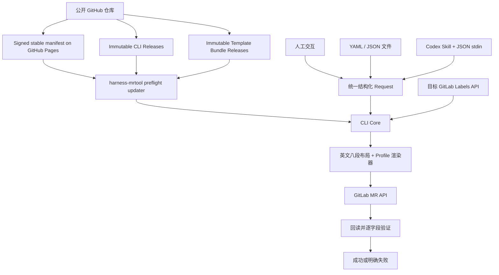

# Harness MR Tool 需求文档

| 项目 | 内容 |
| --- | --- |
| 文档编号 | HMR-REQ-001 |
| 产品名称 | Harness MR Tool |
| 本地项目名 | `harness-mrtool` |
| CLI 命令 | `harness-mrtool` |
| 文档版本 | v0.3.0 |
| 文档状态 | Reviewing |
| 创建日期 | 2026-08-13 |
| 最近更新 | 2026-08-13 |
| 维护角色 | 工具维护者 / 研发规范负责人 |
| 适用范围 | GitLab Merge Request 的创建、更新、预览与完整性验证 |
| 发布位置 | 公开 GitHub 仓库；owner 与最终仓库 URL 在公开发布前确定 |

## 1. 背景

近期由 AI、临时脚本或零散命令创建 Merge Request 时，重复出现以下问题：

- MR 标题和描述由 AI 临场组织，格式与团队规范发生漂移；
- 八个必填章节缺失、顺序变化、内容混入其他语言的固定文案，或残留模板占位符；
- 代码、文档、CI/配置等不同类型变更需要的信息不同，单一僵化表单容易产生无关内容；
- 忘记设置标签，或按记忆填写目标项目中不存在的标签；
- AI 把标题摘要、正文摘要、Issue 信息、验证结果和 Review 状态混在一起；
- 不同任务分别使用网页、Git push options、`glab` 或临时 API，最终结果不稳定；
- MR 创建后没有回读 GitLab 实际状态，却可能被误报为已经正确完成；
- CLI、模板和 AI Skill 分别更新时可能出现版本不兼容或内容漂移。

团队需要一条可选、稳定、可复用的 MR 创建路径。该路径不限制其他同事继续使用 GitLab 网页、IDE、`glab` 或原生 API，但任何通过本工具完成且返回成功的 MR，都必须满足本次实际使用的模板、Profile 和标签策略。

## 2. 产品目标

### 2.1 核心目标

交付一个确定性的 MR 生成与提交工具 `harness-mrtool`，统一承担：

1. 在每次业务命令执行前检查公开 GitHub 上的稳定版本；
2. 选择并验证相互兼容的 CLI、模板 Bundle、Policy 和 Skill 协议；
3. 从目标 GitLab 项目实时读取当前有效标签，而不是维护标签值副本；
4. 接收人工交互、YAML/JSON 文件或 YAML/JSON stdin 提供的结构化数据；Codex 标准路径使用 JSON stdin；
5. 使用固定英文八段布局与版本化 Profile 生成 MR 标题和描述；
6. 只接受 CLI 发放的候选 token，并在内部解析为 GitLab 中真实存在的 Label/User ID；不接受任意标签或人员字符串；
7. 创建或更新 MR；
8. 从 GitLab 回读最终 MR，并逐字段验证实际结果；
9. 仅在全部适用的后置条件通过时返回成功。

### 2.2 成功保证

当 `harness-mrtool` 以退出码 `0` 返回创建或更新成功时，必须证明当时 GitLab 上的 MR：

- 使用了一个已验证的 CLI 与模板 release set；
- 恰好包含八个固定英文二级标题，顺序正确；
- 所有 Profile 要求的字段均存在，并满足各自的必填、互斥和数量约束；
- 不包含未解析占位符或用户可见的工具控制标记；
- 只包含一个格式合法、由渲染器生成的不可见诊断标记；
- 所有受管标签均来自目标项目或其祖先组当前存在且未归档的标签；
- 每个必选标签类别均满足数量约束；
- 标题、目标分支、Draft/Ready 状态、assignee、reviewers 及其他受管字段与写入计划一致；
- GitLab 回读值与工具计划写入的值一致。

本保证覆盖结构完整性、选择合法性、版本一致性和实际写入结果。它不保证 AI 或用户填写的自然语言在业务上绝对真实。验证、CI 和 Review checkbox 只有在存在对应证据时才能勾选。

### 2.3 自愿使用边界

本工具是便利工具，不是组织级强制门禁：

- 不要求所有同事必须使用；
- 不改变 GitLab 合并规则；
- 不阻止网页、IDE、`glab` 或 API 工作流；
- 不评价未使用本工具创建的 MR；
- 只对自身返回的成功结果作出上述保证。

## 3. 非目标

V1 不包含：

- GitLab Webhook、External Status Check、Pipeline Execution Policy 或新的合并门禁；
- 自动创建、删除、重命名或归档 GitLab 标签；
- 自动合并 MR 或自动启用 Auto Merge；
- 替代 GitLab Approval Rules、CODEOWNERS 或 CI；
- 判断自然语言描述是否完全符合真实业务意图；
- 在每个业务仓库复制模板、Profile 或标签判断实现；
- 图形化桌面应用或常驻后台服务；
- 长期安装第二个 launcher 进程；
- 把 Windows Authenticode 证书作为本地开发、V1 功能验收或首次试用的前置条件。

## 4. 已确认的产品决策

| 主题 | 决策 |
| --- | --- |
| 核心形态 | 单个自包含二进制 CLI |
| Windows 文件 | `harness-mrtool.exe` |
| Linux/macOS 文件 | `harness-mrtool` |
| 本地项目名 | `harness-mrtool` |
| 公开仓库 | 最终发布到公开 GitHub；owner 和最终 URL 在上传前确定 |
| 唯一事实源 | 同一个公开 GitHub 仓库中的 CLI 源码、模板、Policy、Schema 和 Skill |
| 模板结构 | 一套固定纯英文八段基础布局 |
| Profile | `code`、`docs`、`ops`、`general`，支持 `code+docs` 等组合 |
| 标签值 | 每次从目标 GitLab 项目及祖先组实时读取 |
| 主要输入 | 三类 transport：人工交互、YAML/JSON 文件、YAML/JSON stdin；Codex 使用 JSON stdin |
| 自动更新 | 每次调用前检查；稳定版本可自动应用 |
| GitHub 不可用 | 使用最近一次验证成功的 CLI 与模板并明确警告 |
| Skill 更新 | 本次 invocation 固定已加载 protocol；新版先进入非扫描 staging，显式激活后的发现时机由 Codex host 决定 |
| Authenticode | 发布阶段可选增强，不属于 V1 验收条件 |

## 5. 目标用户与典型调用

### 5.1 人工交互

开发者在 Git 仓库中执行：

```powershell
harness-mrtool create
```

工具完成版本检查、项目识别、Profile 检测、标签读取，然后依次收集八段内容。长文本通过安全的临时 YAML 或用户配置的编辑器填写，checkbox 和标签通过枚举选择，不要求把八段正文全部写成命令行参数。

可使用少量参数预填标量字段：

```powershell
harness-mrtool create `
  --profile auto `
  --type fix `
  --module luban-studio `
  --title-summary "Keep Qt WebEngine compatible with Tailwind CSS output"
```

`--title-summary` 只表示标题中的简短摘要，不表示第一节正文 Summary。V1 不提供含义模糊的 `--summary` 参数。

### 5.2 YAML 文件

适合人工准备较长的八段内容：

```powershell
harness-mrtool create --input .\mr-request.yaml --non-interactive
```

### 5.3 JSON stdin

适合 Codex 和其他自动化调用：

```powershell
Get-Content .\mr-request.json -Raw |
  harness-mrtool create `
    --input - `
    --input-format json `
    --non-interactive `
    --output json
```

这里的 JSON 在管道左侧的 `mr-request.json` 中。`--input -` 表示 CLI 从当前进程的标准输入读取完整 payload。

Codex 实际调用时可直接通过子进程 stdin 写入 JSON，不需要先创建临时文件，也不得把 Token 或完整多行内容放进命令行参数。

### 5.4 更新与验证

```powershell
harness-mrtool update 123 --input .\mr-request.yaml
harness-mrtool verify 123 --level structure
harness-mrtool verify 123 --level ready
harness-mrtool verify 123 --level merge
```

## 6. 总体架构



### 6.1 组件边界

| 组件 | 唯一职责 |
| --- | --- |
| CLI 二进制 | 更新检查、输入归一化、Profile 选择、渲染、GitLab 写入与回读验证 |
| Template Bundle | 八段布局、字段 Schema、Profile、checkbox 与标签类别 Policy |
| Codex Skill | 分析变更、收集缺失信息、调用 CLI 的结构化接口 |
| GitHub | 源码和规范唯一事实源、Release assets、稳定版本清单 |
| GitLab | 目标项目标签、Issue/MR 数据、用户与 Review 状态 |

Skill、项目模板副本和 AI prompt 均不得重新实现 CLI 的确定性规则。

## 7. 公开 GitHub 仓库与发布

### 7.1 仓库定位

本地开发阶段统一使用项目名 `harness-mrtool`。公开发布前再确定 GitHub owner、最终仓库 URL 和许可证，不影响本地实现与验收。

建议仓库结构：

```text
harness-mrtool/
├── cmd/
│   └── harness-mrtool/
├── internal/
├── schemas/
│   ├── request-v1.schema.json
│   └── output-v1.schema.json
├── template-bundle/
│   ├── layout.md
│   ├── policy.yml
│   ├── schema.json
│   └── profiles/
│       ├── code.yml
│       ├── docs.yml
│       ├── ops.yml
│       └── general.yml
├── skill/
│   └── harness-mr/
│       ├── SKILL.md
│       ├── agents/
│       │   └── openai.yaml
│       └── scripts/
├── scripts/
│   ├── install.ps1
│   └── install.sh
└── .github/
    └── workflows/
        ├── ci.yml
        ├── release-cli.yml
        ├── release-template.yml
        └── publish-channel.yml
```

实际实现语言和内部目录可在技术设计中调整，但产物边界不得变化。

### 7.2 GitHub 是唯一事实源

以下内容只在该公开 GitHub 仓库维护：

- CLI 源码；
- 固定英文八段布局；
- Profile 和字段 Policy；
- 输入/输出 Schema；
- Codex Skill；
- 安装、更新和发布工作流。

GitLab 中的 `.gitlab/merge_request_templates/*.md` 只能是生成投影，不得反向成为事实源。模板和 Policy 不再从公司 GitLab 或 `16-devops` 读取。

### 7.3 Release 产物

CLI 和模板使用独立版本与 tag 命名空间：

```text
cli-v1.2.3
templates-v1.4.0
skill-v1.1.0
```

要求：

- CLI 二进制与模板 Bundle 使用 GitHub Release assets 长期保存；
- 不使用会过期的 GitHub Actions workflow artifacts 作为团队分发源；
- 启用 GitHub Immutable Releases；
- 发布顺序为 Draft Release、上传全部资产、验证、最后发布；
- 每个资产记录大小和 SHA-256；
- Release 生成构建 provenance/attestation；
- 发布后不得覆盖同版本资产或移动对应 tag；
- 坏版本使用新 manifest sequence 回滚到旧的不可变资产，不复用版本号。

### 7.4 稳定版本清单

GitHub Pages 只托管体积很小的 signed channel envelope，不托管二进制。外层 envelope 避免“签名字段是否属于被签内容”的自引用问题：

```json
{
  "payload": "<base64url encoded UTF-8 manifest bytes>",
  "signatures": [
    {
      "keyId": "release-key-1",
      "algorithm": "Ed25519",
      "signature": "<base64url detached signature over decoded payload bytes>"
    }
  ]
}
```

解码后的 payload 示意：

```json
{
  "manifestVersion": 1,
  "sequence": 42,
  "channel": "stable",
  "issuedAt": "2026-08-13T08:00:00Z",
  "components": {
    "cli": {
      "version": "1.2.3",
      "tag": "cli-v1.2.3",
      "inputSchemas": [1],
      "policySchemas": [1],
      "skillProtocols": [1],
      "artifacts": {
        "windows-x64": {
          "name": "harness-mrtool-windows-x64.zip",
          "sha256": "...",
          "size": 12345678
        }
      }
    },
    "templates": {
      "version": "1.4.0",
      "tag": "templates-v1.4.0",
      "policySchema": 1,
      "minCliVersion": "1.2.0",
      "asset": "harness-mr-templates.zip",
      "sha256": "...",
      "size": 45678
    },
    "skill": {
      "version": "1.1.0",
      "tag": "skill-v1.1.0",
      "skillProtocol": 1,
      "cliVersionRange": ">=1.2.0 <2.0.0",
      "asset": "harness-mr-skill.zip",
      "sha256": "...",
      "size": 12345,
      "activation": "explicit-host-refresh"
    }
  },
  "releaseSet": {
    "id": "stable-42",
    "cli": "1.2.3",
    "templates": "1.4.0"
  },
  "security": {
    "minimumAllowedCliVersion": "1.0.0",
    "revokedCliVersions": [],
    "revokedReleaseSetIds": []
  },
  "recommendedSkillVersion": "1.1.0"
}
```

签名协议固定为 Ed25519。验签必须发生在解析 payload JSON 之前，签名输入是 `payload` 解码得到的精确字节。base64url 不带 padding。Manifest payload 不包含自身签名字段，也不依赖不同 JSON 库的重新序列化结果。

CLI 与 Template/Policy 构成原子 release set；Skill 不是当前进程可以热替换的成员，只声明推荐版本和兼容范围。每次 Skill 调用另行记录 `loadedSkillVersion`、`loadedSkillProtocol`、`installedSkillVersion`、`stagedSkillVersion` 和 `activationRequired`。

Manifest 必须使用 CLI 内置公钥可验证的签名。客户端持久化已接受的最高 `sequence`，普通 manifest 不得降低该值；回滚必须使用更高 sequence 并显式指向旧的不可变资产。只信任 mutable Pages 文件中的 SHA-256 不足以保护自动更新。

### 7.5 每次调用前检查

除内部更新子进程外，每次 CLI 调用都执行 preflight：

1. 在固定网络预算内请求稳定 manifest；默认连接超时为 1 秒、整次请求总超时为 2 秒，业务命令的 preflight 不在同一次调用内自动重试；
2. 若服务器提供 `ETag` 或 `Last-Modified`，保存并发送条件请求；
3. 解码 signed envelope，验证 Ed25519 签名、sequence、固定仓库范围和 Schema；
4. 解析当前平台可用资产；
5. 求 CLI、模板、输入 Schema 和已加载 Skill protocol 的兼容交集；
6. 有兼容新版时先完成业务前更新阶段：下载、验证、自检，并确保本次命令由该新版 CLI/Bundle tuple 接管；Windows 正式路径替换可在业务结束后持久化；
7. 再执行用户原始业务命令。

“每次检查”不表示每次都下载完整 Release。无变化时只完成一次小型条件请求。Signed envelope 的响应体上限为 256 KiB，超限按不可验证 manifest 处理。显式执行 `self-update check --force` 可以使用独立的 15 秒总预算，但不得改变普通业务命令的 2 秒上限。

不得每次匿名轮询 GitHub Releases REST API。公开 API 在共享出口 IP 下容易触及速率限制，也不能可靠表达 CLI 与模板两条独立版本线。

### 7.6 单二进制自更新

正常安装只保留一个主要 CLI 二进制，不长期安装第二个 launcher。

发现 CLI 新版时：

1. 仅在用户可写安装目录中执行自更新，并下载到同一磁盘卷的 staging 目录；
2. 校验 manifest 签名、资产大小、SHA-256 和包结构；
3. 拒绝绝对路径、父目录穿越、符号链接逃逸和重复文件；
4. 运行新版本的只读自检；
5. 只有命令显式声明 `--input -` 时，才在更新前把 piped stdin 完整读到 EOF；payload 在内存中最多 2 MiB，需要跨进程时写入仅当前用户可读、带随机名的临时文件，并记录精确长度与 SHA-256；
6. 交互 wizard 的 stdin 为 TTY/console，不预读也不等待 EOF；staging CLI 直接继承 console handles 并独占提示/输入，旧进程不消费用户按键。非 TTY 数据若未用 `--input -` 声明则返回 `INPUT_ERROR`，不静默丢弃；
7. 构造内部 invocation envelope，包含原始 argv、cwd、允许继承的环境变量名、可选 stdin temp path/length/hash、stdio mode 和本次 release-set proposal；不得把 Token 值写入 envelope；
8. Linux/macOS 在平台允许时原子替换后，以同一进程/受控子进程执行原业务；Windows 先从已验证 staging 路径启动新 CLI 执行业务，传入 envelope 并禁用递归 preflight；
9. 原进程等待 staging CLI 完成，独占转发其 stdout/stderr，并原样返回业务 process exit code；旧进程和 helper 不得额外写 stdout。无论成功失败都安全删除 stdin 临时文件；
10. Windows 原进程随后启动临时 helper；helper 等待原进程退出，使用事务日志与 `.old`、`ReplaceFile` 或同等能力更新 `harness-mrtool.exe`，再提交 release-set activation record；本次业务已经由新 CLI 执行，不需要在 helper 中重放 stdin 或再次写 GitLab；
11. helper 替换失败不改变刚才业务结果，但事务保持 pending，下一次启动必须先恢复/重试并在 JSON update 字段报告；不得把尚未完成的物理安装报告为 fully installed；本次命令可报告 `executedVersion=<new>`、`installedVersion=<old>`、`persistencePending:true`；
12. readiness 失败或受控替换步骤报错时恢复 `.old`；
13. 断电、文件系统损坏或杀毒软件在关键窗口终止所有进程时，允许用户运行版本化 `install.ps1 --repair` 恢复 last-known-good；不得声称单二进制架构能对这些非受控故障作绝对无损保证。

临时更新子进程完成后删除，不属于长期安装的第二个程序。

### 7.7 模板与 Skill 更新

- 模板 Bundle 下载到版本化缓存目录，验证后原子切换当前指针；
- 下载与 staging 可以分别使用 CLI/模板锁，但激活只使用一个进程锁、事务 journal 和单一 `active-release-set.json` commit pointer；该 record 至少固定 CLI version/hash、Template version/hash、Schema、manifest sequence 和 transaction ID；
- 启动时先恢复未完成 journal，再验证“正在执行的 CLI + activation record + template cache”是 manifest 允许的同一 tuple；物理文件混合但尚未 commit 时不得进入业务逻辑，而是完成 commit 或从 `.old` 回滚；
- 新模板要求更高 CLI 版本时必须先升级 CLI；
- CLI 与 Template/Policy 任一不兼容时不得形成部分 release set；
- V1 的 Skill 载体明确为用户目录中的 standalone Codex Skill，不承诺修改 Codex plugin/marketplace 的受管缓存；
- CLI 每次检测 Skill 推荐版本，但自动下载只进入 CLI 私有、Codex 不扫描的 staging；默认报告 `activationRequired:true`，不覆盖 active Skill 路径；
- 只有用户显式执行 `skill install --path <user-owned-skill-root>` 或 `skill activate` 时，才允许原子修改 user-owned active path；CLI 不修改 Codex plugin/marketplace 受管缓存；
- 当前 invocation 始终使用调用开始时声明的 loaded Skill instructions/protocol，不会在中途改变。显式激活后，Codex 何时重新发现 Skill 由 host 决定：可能是后续调用，也可能需要新会话；工具必须输出 `hostRefreshMayBeRequired:true`，不得承诺严格“只在下个会话”；
- CLI 更新前必须检查调用者声明的 loaded Skill protocol。新版不兼容时，本次 Skill 调用延后 CLI 更新；
- 稳定 CLI 必须支持所有尚未 EOL 的 Skill protocol。任意过旧的已加载 invocation 若不再兼容，只允许只读诊断并要求 host refresh/新会话，不保证无限期兼容任意历史 Skill。

### 7.8 GitHub 不可访问

若 GitHub 超时、DNS/TLS 失败、返回 `429`/`5xx`，或 manifest 无法验证：

- 使用最近一次完整验证成功的 release set；
- 在终端和 JSON 输出中明确标记 update check 失败；
- 业务命令仍可继续；
- 不得把旧版误报为“已确认是当前最新版”；
- 不得切换到未完成验证的新下载；
- 本地完全没有可用 release set 时才失败。

远端 envelope 签名无效、sequence 回退或新版 asset hash 不符属于 security anomaly，而不是可接受的新状态。若本地 active release set 仍能通过自身记录的完整性校验，普通业务命令可以继续使用它并返回 `UPDATE_CHECK_WARNING`、`securityAnomaly:true`；候选下载必须隔离并删除。显式 `self-update apply` 在同一情况下返回 `UPDATE_SECURITY_ERROR`。若本地 active/last-known-good 自身也无法通过校验、没有可信初始 Bundle，或已验签 manifest 明确撤销当前 release set，则所有有副作用命令返回 fatal `UPDATE_SECURITY_ERROR`/`UPDATE_REQUIRED`。

正式 CLI Release 必须随二进制携带来自同一公开仓库、同一发布流程的兼容初始 Template Bundle，因此正常安装后即存在一个 last-known-good 组合。

如果已成功读取的新 manifest 明确撤销当前版本或设置最低安全版本，则更新失败时阻止有副作用的 `create`/`update`，但允许 `version`、`doctor`、`preview` 和导出诊断。

用户已经选择无限期离线可用，因此远程撤销是 best-effort：它只对成功取得对应签名 manifest 的客户端生效。持续无法连接 GitHub 的客户端无法知道后来发布的撤销信息，工具必须披露这一安全边界，不得声称具备全局强制撤销能力。

### 7.9 初始信任与密钥轮换

- 首次安装从精确、不可变的 GitHub Release 下载，不执行默认分支上的 mutable 远程脚本；
- 版本化 `install.ps1` / `install.sh` 与 CLI Release 一起发布，固定该版本资产 SHA-256 和更新签名公钥；
- 用户首次安装时信任公开 GitHub 仓库和该不可变 Release，可选使用 GitHub Release attestation 做额外来源验证；
- 安装后的自动更新以 CLI 内置 Ed25519 公钥为信任根；
- 密钥轮换 manifest 必须同时由仍受信旧 key 签名，并携带新 key、启用 sequence 和撤销 sequence；
- 资产的必需客户端校验是“已签 manifest 中的 size + SHA-256”；GitHub attestation 是发布来源证明，不要求客户端依赖预装 `gh` 才能运行。

## 8. 模板与 Profile

### 8.1 固定八段合同

所有 Profile 必须输出以下八个二级标题，英文文本、编号和顺序均不可改变：

1. `## 1. Changes`
2. `## 2. Motivation`
3. `## 3. Related Issue / Work Item`
4. `## 4. Impact Scope`
5. `## 5. Verification`
6. `## 6. Documentation`
7. `## 7. Risks and Rollback`
8. `## 8. Review / CI Checklist`

渲染后的规范骨架如下。`{{...}}` 只表示仓库中 `layout.md` 的机器占位符，最终 MR 中必须全部替换：

```markdown
## 1. Changes

### Summary

{{changes.summary}}

### Technical Changes

{{changes.technicalChanges}}

### Out of Scope

{{changes.outOfScope}}

{{profileFields.changes}}

## 2. Motivation

### Background

{{motivation.background}}

### Why This Change Is Needed

{{motivation.whyNeeded}}

{{profileFields.motivation}}

## 3. Related Issue / Work Item

{{workItem.canonicalRelationLines}}
- Milestone: {{issueSnapshot.milestone}}
- Issue Assignee: {{issueSnapshot.assignees}}
- Due Date: {{issueSnapshot.dueDate}}
- Issue Labels: {{issueSnapshot.labels}}
- Merge Request Labels: {{mergeRequest.labels}}

## 4. Impact Scope

{{impact.checkboxes}}

{{impact.details}}

{{profileFields.impact}}

## 5. Verification

{{verification.checkboxes}}

| Check | Command / Method | Result | Evidence |
| --- | --- | --- | --- |
{{verification.rows}}

### Acceptance Evidence

{{verification.acceptanceEvidence}}

### Known Gaps

{{verification.knownGaps}}

## 6. Documentation

{{documentation.checkboxes}}

{{documentation.details}}

{{profileFields.documentation}}

## 7. Risks and Rollback

### Risk Level

{{risk.levelCheckboxes}}

### Risks

{{risk.items}}

### Compatibility Impact

{{risk.compatibilityImpact}}

### Rollback Plan

{{risk.rollbackPlan}}

{{profileFields.risk}}

## 8. Review / CI Checklist

{{review.checkboxes}}

### Reviewer Focus

{{review.reviewerFocus}}

### Additional Notes

{{review.additionalNotes}}

{{diagnosticMarker}}
```

### 8.2 英文范围

“纯英文模板”指：

- 八段标题、子标题、固定说明、表头、checkbox label 和 renderer-owned 文案必须是英文；
- 用户或 AI 填写的具体内容允许中文及其他合法 UTF-8 文本；
- CLI 不负责机器翻译用户内容；
- Profile 不得改写固定八段标题为其他语言。

### 8.3 基础 checkbox

Impact Scope 的基础选项按固定顺序提供：

```markdown
- [ ] App
- [ ] Platform
- [ ] Cloud
- [ ] Controller App
- [ ] Motion Control
- [ ] FPGA
- [ ] CAD/CAM
- [ ] Vision AI
- [ ] Process
- [ ] Shared Schema / Protocol
- [ ] QA
- [ ] Release
- [ ] DevOps
- [ ] Hardware / Electrical / Mechanical / Manufacturing
```

Impact Nature 是另一个恰好单选的维度，按固定顺序渲染：

```markdown
- [ ] Functional Change
- [ ] Non-Functional Change
- [ ] Documentation Only
```

Documentation 的基础选项按固定顺序提供：

```markdown
- [ ] No documentation changes required
- [ ] Interface / Schema / Protocol documentation updated
- [ ] Design documentation updated
- [ ] Test documentation updated
- [ ] Release notes updated
- [ ] README updated
- [ ] Applicable documentation policy reviewed
```

Risk Level 必须恰好选择一个：

```markdown
- [ ] Low
- [ ] Medium
- [ ] High
```

Review / CI Checklist 的基础选项为：

```markdown
- [ ] Source branch is synchronized with the target branch
- [ ] Commit messages comply with the configured project convention
- [ ] The correct Issue or work item is linked, or the absence is explained
- [ ] Milestone, assignee, due date, and labels have been reviewed
- [ ] No passwords, tokens, certificates, or SSH private keys are committed
- [ ] No temporary files, build artifacts, personal configuration, or unintended large files are committed
- [ ] CI has passed, or its current status is documented
- [ ] At least one module owner or maintainer has been requested for review when required
- [ ] At least two reviewers have been requested for high-risk changes
- [ ] All known blocking issues are resolved
```

Verification 的基础 checkbox 由 Profile 从以下稳定 ID 中选择并排序：

```markdown
- [ ] Local build completed
- [ ] Relevant unit tests passed
- [ ] Relevant integration tests passed
- [ ] Core behavior verified
- [ ] Documentation links and formatting verified
- [ ] Deployment or pipeline behavior verified
```

V1 categorical/evidence checkbox registry 的 ID 与上述英文 label 固定对应：

| Section | Stable ID | Fixed English label |
| --- | --- | --- |
| Impact area | `app` | `App` |
| Impact area | `platform` | `Platform` |
| Impact area | `cloud` | `Cloud` |
| Impact area | `controller-app` | `Controller App` |
| Impact area | `motion-control` | `Motion Control` |
| Impact area | `fpga` | `FPGA` |
| Impact area | `cad-cam` | `CAD/CAM` |
| Impact area | `vision-ai` | `Vision AI` |
| Impact area | `process` | `Process` |
| Impact area | `shared-schema-protocol` | `Shared Schema / Protocol` |
| Impact area | `qa` | `QA` |
| Impact area | `release` | `Release` |
| Impact area | `devops` | `DevOps` |
| Impact area | `hardware-manufacturing` | `Hardware / Electrical / Mechanical / Manufacturing` |
| Impact nature | `functional` | `Functional Change` |
| Impact nature | `non-functional` | `Non-Functional Change` |
| Impact nature | `docs-only` | `Documentation Only` |
| Documentation | `no-documentation-changes` | `No documentation changes required` |
| Documentation | `interface-schema-protocol-documentation` | `Interface / Schema / Protocol documentation updated` |
| Documentation | `design-documentation` | `Design documentation updated` |
| Documentation | `test-documentation` | `Test documentation updated` |
| Documentation | `release-notes` | `Release notes updated` |
| Documentation | `readme` | `README updated` |
| Documentation | `documentation-policy-reviewed` | `Applicable documentation policy reviewed` |
| Risk | `low` | `Low` |
| Risk | `medium` | `Medium` |
| Risk | `high` | `High` |
| Verification | `local-build` | `Local build completed` |
| Verification | `unit-tests` | `Relevant unit tests passed` |
| Verification | `integration-tests` | `Relevant integration tests passed` |
| Verification | `core-behavior` | `Core behavior verified` |
| Verification | `docs-links-format` | `Documentation links and formatting verified` |
| Verification | `deployment-pipeline` | `Deployment or pipeline behavior verified` |

ID、label、section 和 order 都属于 Bundle 中央 registry 的版本化合同。Request 只能传 ID，renderer 只从 registry 取英文 label；重复 ID、未知 ID 或跨 section 使用均失败。

### 8.4 Profile 定义

V1 提供四类 Profile：

| Profile | 适用变更 | 主要附加要求 |
| --- | --- | --- |
| `code` | 源码、接口、运行时逻辑、测试 | Technical Changes、构建/测试、兼容性和运行时风险 |
| `docs` | Markdown、设计文档、用户文档、发布说明 | 目标读者、链接、格式、预览和内容影响 |
| `ops` | CI、构建、配置、部署、发布脚本 | 影响环境、发布验证、配置兼容和回滚 |
| `general` | 不能可靠归类的其他变更 | 八段基础字段和保守验证要求 |

V1 field registry 至少固定以下 Profile 字段和 section slot：

| Field ID | Profile | 固定英文 H3 | Slot | 类型 | 必填 |
| --- | --- | --- | --- | --- | --- |
| `docs.target-audience` | `docs` | `Target Audience` | `motivation` | 非空字符串列表 | 是 |
| `docs.content-impact` | `docs` | `Content Impact` | `changes` | 非空字符串列表 | 是 |
| `ops.affected-environments` | `ops` | `Affected Environments` | `impact` | 非空枚举/字符串列表 | 是 |
| `ops.deployment-plan` | `ops` | `Deployment Plan` | `changes` | 非空步骤列表 | 是 |
| `ops.configuration-compatibility` | `ops` | `Configuration Compatibility` | `risk` | 非空字符串列表 | 是 |

基础字段合同：

| Profile | 必填基础字段与 evidence-state |
| --- | --- |
| `code` | `changes.technicalChanges`、`risk.compatibilityImpact`；`local-build`、`unit-tests`、`integration-tests`、`core-behavior` 必须逐项给出 checked/pending/not-applicable 与证据或理由 |
| `docs` | 上述两个 docs registry 字段；`docs-links-format` 必须给出 evidence-state；Documentation 不能选择 `no-documentation-changes` |
| `ops` | 上述三个 ops registry 字段；`deployment-pipeline` 必须给出 evidence-state；`risk.rollbackPlan` 必填 |
| `general` | 所有八段基础字段；至少一项 verification evidence-state |

Profile-specific 字段按中央 registry 的 `order` 渲染到对应 `{{profileFields.<slot>}}`。没有激活相应 Profile 时不渲染其 H3；激活后必填字段为空即返回 `INPUT_ERROR`。

Profile 只能：

- 在八段内部引用中央 field registry 中已有的稳定字段 ID；
- 引用中央 checkbox registry 中已有的稳定 checkbox ID；
- 调整字段是否必填；
- 提供文件匹配规则；
- 提供标签类别建议规则；
- 增加可测试的跨字段约束。

Profile 不得增加第九个二级标题、重排八段或维护另一份完整 Markdown。

### 8.5 Profile 自动选择与组合

典型调用：

```powershell
harness-mrtool create --profile docs
harness-mrtool create --profile code+docs --input .\mr-request.yaml
harness-mrtool create --profile auto
```

CLI 的规范组合语法使用 `+`，例如 `code+docs`；Request 中始终使用排序后的数组 `"profileIds": ["code", "docs"]`。逗号不作为 Profile 分隔符。

`auto` 使用 Template Bundle 中的版本化路径规则和 canonical ChangeSet 确定性判断。`create`/`update` 要求工作区无 staged、unstaged 或未跟踪的业务文件；ChangeSet 是目标分支本地 tracking ref 与 source HEAD 的 merge-base 到 source HEAD 的 committed diff。命令记录 target ref SHA、merge-base SHA 和 source HEAD SHA：

- 只有文档路径或文档扩展名：`docs`；
- 只有代码及代码测试：`code`；
- CI、构建、部署、配置或发布路径：`ops`；
- 同时命中多个类别：组合 Profile，例如 `code+docs`；
- 不能可靠判断：交互模式要求用户选择；
- 非交互模式不能可靠判断：返回 `PROFILE_REQUIRED`，不得由 AI 自由猜测。

V1 初始匹配规则至少包括：

| Profile | 路径/扩展名示例 |
| --- | --- |
| `docs` | `docs/**`、`**/*.md`、`**/*.mdx`、`README*`、`CHANGELOG*`、`.gitlab/*_templates/**` |
| `ops` | `.github/**`、`.gitlab-ci.yml`、`.gitlab/ci/**`、`Dockerfile*`、`docker-compose*.yml`、`deploy/**`、`helm/**`、`k8s/**` |
| `code` | `src/**`、`test/**`、`tests/**` 及 Bundle registry 中声明的源代码/测试扩展名 |
| `general` | 全部文件均未命中 `code`/`docs`/`ops`，但命中版本化 general 规则的其他已知变更 |

rename 同时按旧路径和新路径分类，delete 按旧路径分类。一个文件或多个文件命中多个 Profile 时取组合。任意 diff item 未命中版本化 registry、属于未知二进制或 unsupported submodule change 时，整个 auto detection 结果为 `ambiguous`：交互要求选择，非交互返回 `PROFILE_REQUIRED`；不得忽略未知项，也不得自动把 `general` 与其他 Profile 组合。只有所有 item 都能被 registry 分类时，才应用组合规则。精确扩展名与优先级以版本化 Profile fixture 为准，发布校验必须覆盖 known+unknown 混合、rename、delete、大小写和路径分隔符归一化。`context`/`preview` 可以在 dirty worktree 上提供建议，但不得把未提交内容视为即将写入 GitLab 的 MR diff。

组合规则：

- `general` 是兜底 Profile，不与 `code`、`docs`、`ops` 组合；
- 多 Profile 对字段、checkbox 和验证规则取并集；
- 相同稳定 ID 去重；
- 排序固定为基础项、`code`、`docs`、`ops`；
- 任一 Profile 声明必填时，该字段在组合后必填；
- field/checkbox 的类型、enum、cardinality、section slot 和基础默认值只能由 Bundle 中央 registry 定义，Profile 不得重定义；
- Bundle 发布校验必须穷举 `code`、`docs`、`ops` 的全部允许组合；
- 出现互相矛盾的 Profile 规则时 Bundle 发布校验失败，不得交由运行时猜测。

Profile 与 GitLab Label 是不同概念。Profile 决定“描述需要填什么”，Label 表示目标项目中的分类状态。`docs` 可以建议 `type::doc`，但只有该标签在目标 GitLab 当前真实存在时才能选择。

### 8.6 Checkbox 状态与证据

checkbox 分为三类，必须使用不同的 Schema 表达：

| 类型 | 示例 | 输入模型 | 未勾选含义 |
| --- | --- | --- | --- |
| categorical | Impact area、Impact nature、Documentation updates | selected ID 或单选 enum | 未选择该分类 |
| evidence-state | Build、test、manual verification | `state` + tagged `evidenceKind` + typed evidence fields | 尚未完成或不适用 |
| derived-local | branch、commit、repository hygiene | 不接受用户状态输入，由本地 Git/规则检查派生 | 当前本地检查未满足或不可用 |
| derived-gitlab | CI、review request、approval、blocking discussions | 不接受用户状态输入，由 GitLab 回读 | 当前 GitLab 状态未满足 |
| derived-composite | Issue/work item metadata | 不接受状态输入，由 validated Request 与 GitLab 快照共同派生 | 当前复合条件未满足 |

渲染器拥有所有 checkbox 的固定 label、顺序和 Markdown token：

- `checked` 渲染为 `[x]`；
- `pending` 渲染为 `[ ]`；
- `not-applicable` 渲染为 `[ ]`，并必须在对应 details 或 Verification 表格中给出非空理由；
- 用户和 AI 不能直接传入 `[x]`、`[ ]` 或自定义 checkbox 文案；
- AI 不得仅根据自然语言声称、命令名称或预期结果自动勾选；
- 验证类 checkbox 必须关联命令输出、文件检查或明确人工验证证据；
- 所有 derived state 必须由声明的数据源派生，不能接受输入中的自报 boolean。

每个 checkbox 的中央 registry 必须声明 `id`、固定英文 label、`kind`、`source`、适用 Profile、适用 lifecycle、section slot、order 和 evidence schema。V1 Review / CI 基础项的 source 固定如下：

| Checkbox ID | Source | 派生规则 |
| --- | --- | --- |
| `source-branch-synced` | `derived-local` | source HEAD 与本次记录的 target ref 不存在未合入 target commits |
| `commit-convention` | `derived-local` | commits 全部通过 Bundle Policy 中的版本化规则；未配置规则时为 pending |
| `work-item-reviewed` | `derived-composite` | tagged union 合法，linked case 的 Issue 可读取 |
| `metadata-reviewed` | `derived-gitlab` | Issue/MR snapshot 已成功读取并展示 |
| `secret-scan-reviewed` | `derived-local` | Bundle Policy 配置的 secret scan 实际完成并通过；未配置或未运行时为 pending |
| `repository-hygiene-reviewed` | `derived-local` | Bundle Policy 的受管文件规则实际完成并通过；规则不可用时为 pending |
| `ci-status` | `derived-gitlab` | pipeline 状态通过，或在 ready 层级真实显示 pending/failed |
| `reviewer-requested` | `derived-gitlab` | 当前 MR 至少有 Policy 要求的合格 reviewer |
| `high-risk-reviewers` | `derived-gitlab` | High risk 时当前 MR 至少有 2 名合格 reviewer；其他风险为 not-applicable |
| `blocking-issues` | `derived-gitlab` | unresolved discussions / blocking state 为零；API 不可用时为 pending |

Categorical checkbox 由 selected ID/enum 渲染；未选择只表示该分类未被选中。Evidence-state 使用 `{id,state,evidenceKind,command,result,evidence}` 的 tagged union，CLI 只按 tag 与字段结构判定，不从自然语言猜测状态：

| `state` | 允许的 `evidenceKind` | `command` | `result` | `evidence` |
| --- | --- | --- | --- | --- |
| `checked` | `command-output` | 非空 | 非空 | 具体来源说明 |
| `checked` | `file-inspection` / `manual-verification` | 可为 `null` | 非空 | 具体文件或人工验证说明 |
| `pending` | `pending-reason` | 必须为 `null` | 必须为 `null` | 具体等待原因 |
| `not-applicable` | `not-applicable-reason` | 必须为 `null` | 必须为 `null` | 具体不适用原因 |

所有 `evidence` 在 trim 后至少 16 个 Unicode scalar value，非空 `result` 至少 8 个 Unicode scalar value；这些是统一结构下限，不使用词语黑名单。所有 derived checkbox 均不出现在用户 Request 的 state 字段中；V1 不提供人工证据覆盖 derived 结果的旁路。诊断标记保存完整 state map，因而 `[ ]` 可以在回读时区分 pending 与 not-applicable。

互斥规则：

- Risk Level 恰好选择一个；
- `No documentation changes required` 与任一 documentation-updated 选项互斥；
- Impact Nature 必须恰好选择 `functional`、`non-functional` 或 `docs-only` 之一；
- `docs-only` 时 Profile 只能为 `docs`，且 areaIds 可以为空；
- `functional` 或 `non-functional` 时至少选择一个 area ID；
- 未执行的测试不得标为 `passed`；
- 任何 `not-applicable` 状态必须有具体理由，不能只写 `N/A`。

### 8.7 Canonical 空值渲染

- 八个 H2 和骨架中列出的基础 H3 始终保留；
- 允许为空的字符串或列表统一渲染为英文 `None.`，不得留下空标题；
- linked work item 的 Reason 渲染为 `Not applicable`；none case 的 Issue snapshot 字段渲染为 `Not applicable`；
- Verification 没有 rows 时渲染固定行 `| None | Not applicable | Not run | No evidence |`，但 Profile 的最低 verification 规则仍可能使该 Request 失败；
- Profile-specific H3 只在 Profile 激活时出现，并按 registry order 排序；其必填值不得为空；
- 空值规则属于 Template Bundle，golden tests 必须固定其字节结果。

### 8.8 生命周期语义

结构成功、Ready 和可合并是三个不同层级：

| 层级 | 含义 | Checkbox 要求 |
| --- | --- | --- |
| `structure` | 模板、字段和标签结构合法 | 允许 CI、Review 等未来状态 pending |
| `ready` | 内容已准备好开始正式 Review | 必填内容完整；默认允许验证、CI 和 Approval 保持 pending，但每个 pending 都必须有真实状态或具体理由 |
| `merge` | 当前状态满足工具可观察的合并准备条件 | Policy 要求的 live CI/Review/阻塞项必须通过 |

创建 Ready MR 不等于宣称 CI 和 Review 已完成。工具不得为了让 checklist 看起来完整而伪造勾选。

Profile/Policy 可以把个别 evidence-state 声明为 `requiredForReady` 或 `requiredForMerge`；V1 默认 Profile 只要求这些项“明确给出状态与证据/理由”，不把未运行的本地构建或集成测试自动升级为 Ready 阻断项。这样工具保证信息不缺失，但不替团队替代 Review 判断。

description 中的 live-derived checkbox 是最近一次成功的 `create`/`update` 所捕获的 GitLab 快照，不是后台实时面板。之后 CI、Reviewer 或 discussion 状态改变时，Markdown 可以变旧；`verify --level ready|merge` 始终检查当前 GitLab API，不以旧 checkbox 作为事实。工具不安装后台任务去持续改写 description。

### 8.9 Issue 与人员信息

Related Issue / Work Item 支持：

- `Closes #<iid>`；
- `Related #<iid>`；
- 没有关联 Issue 时提供非空 `noIssueReason`。

该字段是 tagged union：

- linked case 必须包含 `relation=closes|related` 和 `iid`；模板输出 Reference 及 GitLab 快照，Reason 固定输出 `Not applicable`；
- none case 必须包含 `relation=none` 和 `noIssueReason`；模板输出 `Relation: None` 与 Reason，其余 Issue 快照字段使用固定英文 `Not applicable`；
- 不得同时提供 `iid` 和 `noIssueReason`。

V1 默认只解析目标 GitLab 项目内的 Issue IID。Milestone、Issue assignee、due date 和 Issue labels 从 GitLab Issue API 回读形成创建/更新时快照，不由 AI 自由填写。快照以后发生变化不使历史 MR 的 structure 校验失败；`verify` 另行报告 live drift。

linked case 的 canonical relation lines 必须包含 GitLab 可识别的独立一行 `Closes #<iid>` 或 `Related #<iid>`，不能只输出 relation enum。none case 固定输出 `Relation: None` 和 `Reason: <noIssueReason>`。

精确渲染为：linked case 第一行只输出 `Closes #<iid>` 或 `Related #<iid>`，下一行输出 `- Reason: Not applicable`；none case 输出 `- Relation: None` 和 `- Reason: <escaped noIssueReason>`。其后再接 layout 中的 Issue snapshot bullets。所有用户内容仍按 Markdown 字段规则转义，不能通过 reason 注入新 H2 或 checkbox。

MR assignee 与 Issue assignee 是不同字段：

- MR assignee 默认当前 GitLab 用户，用户可显式修改；
- Draft 可暂不选择 Reviewer；
- Ready 默认至少选择 1 名 Reviewer；
- High risk 默认至少选择 2 名 Reviewer；
- Reviewer 字段只表示已请求 Review，不表示已经批准。

Reviewer ID 必须唯一、有效、不能是 MR 作者，并具有目标项目可见性。V1 不声称仅凭用户 ID 能证明其为 module owner；是否属于 owner/maintainer 必须由项目成员角色、CODEOWNERS 或显式 Policy 数据源确定。数据源不可用时相关 checkbox 保持 pending。

上述默认值由 Policy 版本化声明，项目覆盖只能在明确允许的范围内调整。

### 8.10 诊断标记

最终 description 尾部包含一个不可见 HTML comment，至少记录：

- Template Bundle ID 和版本；
- Profile IDs；
- Policy Schema；
- normalized request digest；
- external context snapshot digest；
- rendered description digest；
- CLI 版本。

该标记采用 `<!-- harness-mrtool:v1 <base64url(JCS metadata)> -->`。Request 与 ExternalContextSnapshot 先按 RFC 8785 JSON Canonicalization Scheme 序列化，再分别计算 SHA-256。Rendered description digest 的 preimage 是“移除整个最终 diagnostic comment 后、统一为 LF、保留一个结尾 LF 的 UTF-8 description”；digest 不覆盖自身 comment，避免自引用。

metadata 还必须记录 Template Release tag、Bundle manifest hash、`renderPhase=preview|provisional|final` 和 normalized state map。`preview` 与创建 Draft 时的 provisional description 可以携带非 final phase，但 `create`/`update` 只有在 GitLab 回读到唯一的 `final` marker 后才可返回成功。

该标记用于检测模板漂移和人工修改，不包含 Token、内部 API 地址或用户敏感信息。标记只能由渲染器生成，不能作为安全策略的唯一可信输入。

### 8.11 GitLab 网页模板投影

V1 提供只读导出命令：

```powershell
harness-mrtool template export --profile general --destination Default.md
harness-mrtool template export --profile code --destination Code.md
harness-mrtool template export --profile docs --destination Docs.md
harness-mrtool template export --profile ops --destination Ops.md
```

这些文件可提交到业务仓库的 `.gitlab/merge_request_templates/`，供网页用户参考。V1 不自动批量写入项目，也不在投影模板中硬编码项目标签。

`Default.md` 是 `general` 的通用超集投影，不实现 CLI Profile 自动选择或组合保证。网页用户需要场景化模板时显式选择 `Code.md`、`Docs.md` 或 `Ops.md`；混合变更仍推荐使用 CLI。

## 9. Template Bundle 版本

Template Bundle 是一个原子发布单元，至少包含：

- `layout.md`；
- `schema.json`；
- `policy.yml`；
- 四个 Profile；
- bundle manifest 和文件 SHA-256。

版本规则：

- PATCH：英文提示、错别字或不改变结构的说明修正；
- MINOR：增加向后兼容的可选字段、Profile 或匹配规则；
- MAJOR：增加/删除必填字段、改变八段结构、checkbox 语义或跨字段约束。

CLI、Template Bundle 和 Skill 分别使用 SemVer；`inputSchema`、`policySchema` 和 `skillProtocol` 使用单调整数。不能只根据“版本号同为 1.x”推断协议兼容。

Template Bundle 更新只影响新的 preview/create，不得自动改写已经存在的 MR。已有受管 MR 的 marker 固定其原始 Release tag 与 Bundle hash：

- `verify` 默认使用 marker 指定的原始 Bundle；本地没有时只从对应 immutable GitHub Release 精确下载并校验，不能用 latest Bundle 代替；
- 普通 `update` 默认继续使用原始 Bundle，前提是当前 CLI 仍支持其 Schema；`context --mr <iid>` 和 `schema show --from-mr <iid>` 必须从 marker 精确加载该 Bundle，供人工与 Skill 获取旧 Request Schema、Profile 和候选合同；
- 只有显式 `update <iid> --migrate-template` 才迁移到当前 Bundle；必须先输出旧/新版本、完整 description diff 和校验结果；
- migration context 必须同时返回旧/新 Schema、可自动映射字段、无法映射字段和新增必填字段；任何有损或缺失字段都要求用户补充，AI 不得猜值；
- 交互模式要求再次确认；非交互模式必须提供 `--confirm-migration <old-bundle-hash>:<new-bundle-hash>`，不接受通用 `--yes`；
- 原始 Bundle 已 EOL 或无法验证时，普通 update 失败并说明迁移路径；`verify` 仍应尽可能保持只读，但没有经过验证的原始 Bundle 时不得声称结构合格；
- 没有合法 marker 的人工 MR 不自动归属任何 Bundle；V1 的 `update`/`verify` 返回 `UNMANAGED_MR`，不接管或覆盖 description。把人工 MR 转为受管 MR 的 adopt/migration assistant 延后到 V2。

CLI 在渲染前构造 immutable `ExternalContextSnapshot`，至少包含 target/source project、target ref SHA、merge-base SHA、source HEAD、Issue snapshot、标签候选真实 ID/名称、用户候选、当前 MR state 和可读取的 CI/Review state。GitLab 响应中的易变展示字段只有进入该快照后才能参与渲染。为避免自引用，snapshot 明确排除 description、diagnostic marker、`updated_at`、request ID 和由本次渲染自身产生的字段；这些字段只进入 postcondition comparison，不进入 rendered digest 的外部输入。

同一 normalized Request、同一 ExternalContextSnapshot、同一 Profile 集、同一 Bundle 与同一 CLI 渲染器必须产生字节级一致的标题、description 和受管标签计划。没有“同一外部快照”这一前提时，不承诺两次在线运行字节一致。

## 10. 标签管理

### 10.1 实时来源

标签值不得在 CLI、Skill、模板 Markdown 或 Profile 中维护静态副本。

CLI 必须针对 MR 的目标项目读取项目标签和祖先组标签，遍历全部分页并保留：

- GitLab label ID / GraphQL global ID；
- 名称；
- 描述；
- 颜色；
- 项目或组来源；
- 归档状态。

已归档标签不得作为候选项。同名项目标签和组标签并存时，采用版本化、可测试的项目优先规则，并保留真实 ID。

GitLab REST numeric ID、GraphQL global ID 和 Project/Group scope 是 CLI 内部表示，不作为 Request 协议。`context` 为每次候选快照返回一个 `contextId`，并为 label 与 user 分别发放不可构造的 opaque candidate token。token 必须绑定候选类型、GitLab Host、目标项目、真实 ID、快照和过期时间；默认有效期为 30 分钟。`create`/`update` 必须重新解析 token 并回读真实对象，过期、跨项目、跨类型、删除、重命名或权限变化均失败。调用方只能回传 token，不能在 REST ID、GraphQL ID 或名称之间自行选择。

### 10.2 类别 Policy

`policy.yml` 对用户可选的 `week`、`type`、`priority` 只声明类别、正则和数量约束，不枚举候选标签值；候选值始终来自 GitLab。唯一例外是工具派生的 lifecycle `status`：Policy 必须声明 Draft/Ready/merge 所需的 exact name，才能确定性迁移。V1 默认类别为：

```yaml
labels:
  categories:
    week:
      match: "^week::"
      required: true
      max: 1
    type:
      match: "^type::"
      required: true
      max: 1
    priority:
      match: "^priority::"
      required: true
      max: 1
    status:
      match: "^status::"
      required: true
      max: 1
  lifecycle:
    statusCategory: status
    expectedNames:
      draft: "status::doing"
      ready: "status::review"
      merge: "status::review"
```

实际可选值始终是“Policy 匹配规则”与“目标 GitLab 当前有效标签”的交集。必选类别在目标项目没有候选项时，CLI 停止并指出缺失类别，不得自动创建标签。

`week`、`type` 和 `priority` 由用户或调用方从实时 token 候选中选择。`status` 是 lifecycle-derived 受管类别，不接受 Request 自报：Draft 使用 Policy 的 `draft` 名称，请求 Ready 时在最终转换阶段改为 `ready` 名称，`merge` 验证要求 `merge` 名称。项目 Policy 可以版本化修改这些 exact names；匹配的实时标签不存在时失败，不能退回任意 `status::` 值。合并后把 Issue/MR 状态改为 `done` 不属于 V1 的自动行为。

Lifecycle exact name 使用与普通标签相同的 project-over-group 解析规则。相同优先级出现多个同名对象、名称缺失、已归档或不匹配 `status` category 时返回 `LABEL_ERROR`；CLI 不凭颜色/描述猜测。exact name 只是 Policy 的派生目标，不是用户可选标签清单的静态副本。

### 10.3 人工与 Codex 选择

交互模式展示名称、描述、类别、来源和当前是否已应用。

Codex 只接收 CLI 返回的结构化候选列表，只能提交 opaque candidate token。任何标签名称字符串、原始 GitLab ID、未知 token、已归档对象或类别冲突都返回 `LABEL_ERROR`。

Profile 可以提出建议，例如 `fix -> type::bug` 或 `docs -> type::doc`，但映射目标必须在实时候选集中存在，否则要求重新选择。

### 10.4 写入安全

- 不把未验证的标签字符串传给可能自动创建标签的 REST 参数；
- token 解析后优先使用 GitLab Label ID mutation；
- `doctor` 探测目标 GitLab 是否支持所需 ID 型操作；
- V1 不提供“找不到 ID 时改用名称”的降级；
- 标签读取后、写入前被删除或改名时操作失败；
- 更新已有 MR 时只替换 Policy 声明的受管类别；
- 保留 Policy 范围外的人工标签；
- GitLab MR/label API 没有 expected-version、ETag 或原子 compare-and-set；CLI 不得声称具备服务端锁；
- 写入前即时回读快照，只对该快照中明确需要改变的受管 ID 做最小 ADD/REMOVE，不使用整套 label REPLACE，也不删除预读后新出现的未知 ID；
- source HEAD、目标字段和标签在每个相关写步骤后立即回读；发现漂移时停止，不自动重试，并返回 `CONCURRENT_UPDATE` 或已发生写入后的 `PARTIAL_REMOTE_STATE`；
- 对 GitLab scoped label，ADD 可能由服务端替换同 scope 的现有 label。CLI 必须在 preview 披露这一计划，并在写后验证；
- 在“最后一次预读”与服务端写入之间仍存在无法消除的 TOCTOU 窗口。工具保证成功时最终回读值正确，但不能保证绝不覆盖恰好同时发生的同一受管字段修改；这是 V1 明确残余风险。

## 11. 结构化输入

### 11.1 Transport 与归一化

所有输入最终归一化为同一个内部 Request，并使用版本化 JSON Schema 校验：

1. 交互 wizard；
2. YAML/JSON 文件；
3. YAML/JSON stdin，其中 Codex 标准路径使用 JSON stdin。

要求：

- 文件按 `.yaml`、`.yml`、`.json` 扩展名自动识别，也可用 `--input-format` 显式指定；
- stdin 必须显式指定 `--input-format yaml|json`；
- stdin 使用 UTF-8 并读到 EOF；
- UTF-8 payload 最大 2 MiB，超限返回 `INPUT_TOO_LARGE`；
- YAML 在构建文档 AST 前通过同版本 YAML lexer 惰性扫描，最多允许 20,000 个 lexeme；超限或 lexer 异常返回 `INPUT_ERROR`。quoted scalar 和 comment 的内容长度不增加 lexeme 数，文本总长度仍由独立的 2 MiB 上限约束；
- 解析后的结构化值最大嵌套深度为 256；文件、stdin 和公开的内存输入边界均在递归复制、归一化和 Schema 校验前迭代检查，超限返回 `INPUT_ERROR`；
- YAML 只允许单文档；
- YAML 拒绝重复 key、自定义 tag、对象构造和 alias merge；
- JSON 拒绝重复 key 和尾随内容；
- 非交互模式缺字段时直接失败，不得回退到 prompt；
- 输入文件和 stdin 不能同时使用；
- `--input` 与表达同一字段的 CLI flag 同时出现时，如果值不一致则失败，不做隐式覆盖。

### 11.2 V1 Request 示例

```json
{
  "schemaVersion": 1,
  "contextId": "context:example-7f6d",
  "intent": "ready",
  "profileIds": ["code", "docs"],
  "targetBranch": "develop",
  "title": {
    "type": "fix",
    "module": "luban-studio",
    "titleSummary": "Keep Qt WebEngine compatible with Tailwind CSS output"
  },
  "changes": {
    "summary": [
      "Transform incompatible Tailwind custom property registrations during the Vite bundle stage."
    ],
    "technicalChanges": [
      "Run the PostCSS transform before the single-file plugin inlines CSS."
    ],
    "outOfScope": [
      "Qt, Chromium, and Tailwind upgrades are not included."
    ]
  },
  "motivation": {
    "background": [
      "Qt 6.8.3 Debug WebEngine exits when validating selected Tailwind custom properties."
    ],
    "whyNeeded": [
      "Debug and Release must use the same reliable frontend artifact."
    ]
  },
  "workItem": {
    "relation": "related",
    "iid": 51
  },
  "impact": {
    "areaIds": ["app"],
    "nature": "non-functional",
    "details": [
      "The change is limited to the frontend build compatibility layer and its documentation."
    ]
  },
  "verification": {
    "items": [
      {
        "id": "local-build",
        "state": "checked",
        "evidenceKind": "command-output",
        "command": "cmake --build build-debug --target LubanStudio",
        "result": "Debug target passed",
        "evidence": "Local command output"
      },
      {
        "id": "unit-tests",
        "state": "checked",
        "evidenceKind": "command-output",
        "command": "npm test -- --silent",
        "result": "274 tests passed",
        "evidence": "Local command output"
      },
      {
        "id": "integration-tests",
        "state": "pending",
        "evidenceKind": "pending-reason",
        "command": null,
        "result": null,
        "evidence": "Pending reviewer environment"
      },
      {
        "id": "core-behavior",
        "state": "checked",
        "evidenceKind": "file-inspection",
        "command": null,
        "result": "No Tailwind @property --tw-* registrations remain",
        "evidence": "Generated artifact inspection"
      },
      {
        "id": "docs-links-format",
        "state": "checked",
        "evidenceKind": "file-inspection",
        "command": null,
        "result": "Links and formatting are valid",
        "evidence": "Local document review"
      }
    ],
    "acceptanceEvidence": [
      "The embedded frontend HTML contains zero Tailwind @property --tw-* rules."
    ],
    "knownGaps": [
      "A final runtime check remains pending on the reviewer environment."
    ]
  },
  "documentation": {
    "itemIds": ["design-documentation", "test-documentation"],
    "details": [
      "Updated the implementation and regression-test notes."
    ]
  },
  "risk": {
    "level": "medium",
    "items": [
      "An incomplete fallback would change Tailwind variable defaults."
    ],
    "compatibilityImpact": [
      "No application API or runtime dependency changes."
    ],
    "rollbackPlan": [
      "Revert this MR and rebuild the previous frontend bundle."
    ]
  },
  "profileFields": {
    "docs.target-audience": [
      "Luban Studio maintainers and reviewers"
    ],
    "docs.content-impact": [
      "The design and implementation notes now describe the compatibility transform and its fail-closed checks."
    ]
  },
  "review": {
    "reviewerCandidateTokens": ["user-candidate:reviewer:01"],
    "reviewerFocus": [
      "Review structural PostCSS selection and fail-closed validation."
    ],
    "additionalNotes": []
  },
  "mergeRequest": {
    "assigneeCandidateToken": "user-candidate:assignee:02",
    "labelCandidateTokens": [
      "label-candidate:week:01",
      "label-candidate:type:02",
      "label-candidate:priority:03"
    ],
    "removeSourceBranch": true,
    "squash": true
  }
}
```

示例是一个完整的 `code+docs` Request 形态。三个 opaque `labelCandidateTokens` 分别代表 `week`、`type`、`priority` 的实时 CLI 候选；`status` 由 intent 和 Policy 自动派生。人员 token 同样只能来自同一个 `contextId` 的实时候选，调用方不能构造。运行时的稳定 ID、枚举和必填规则以当前 Template Bundle Schema 为准。

### 11.3 标题与正文摘要分离

`title.titleSummary`：

- 只用于 MR title；
- 必须是 trim 后非空的单行文本；
- 不得包含 Markdown、换行、`Draft:` 或 `[type][module]` 前缀；
- 单行 Markdown 判定对 emphasis delimiter run 使用 CommonMark 的 Unicode whitespace/punctuation left/right-flanking、underscore intraword 和 rule-of-three 规则；HTML comment/tag/autolink、entity、反斜线转义、code span、link/image 和 block marker 也必须拒绝，但不能误拒绝没有形成 Markdown 的普通业务标点；
- 由渲染器拼接完整 title。

`title.type` 与 `title.module`：

- `type` 是 Bundle registry 中的稳定 enum，V1 默认包含 `feat`、`fix`、`docs`、`test`、`refactor`、`perf`、`build`、`ci`、`chore`；项目 Profile 可以收窄但不能由 AI新增；
- `module` 必须是 trim 后非空的单行 slug，字符集为 ASCII 小写字母、数字和单个连字符，长度 1-32，不得以连字符开头/结尾；
- `titleSummary` 长度 1-72 个 Unicode scalar value；完整 Ready title 上限 100，Draft 前缀计入上限；
- selected `type` 必须与 Policy 的 type label compatibility table 一致，例如 `fix` 只能搭配存在于实时候选中的 `type::bug` 映射；不存在映射候选时要求用户重新选择，不自动创建标签；
- Profile 可以给 type/module 建议，但最终值始终经过 Schema 和跨字段校验。

`changes.summary`：

- 只用于 `## 1. Changes` 的 `### Summary`；
- 可以是多条内容；
- 不得默认复制到 title；
- 不得由 titleSummary 自动推断。

标题格式：

```text
Draft: [type][module] <titleSummary>
[type][module] <titleSummary>
```

### 11.4 输入边界

- AI 只能填写 Schema 已声明字段；
- Profile ID、area ID、verification ID、documentation ID、label candidate token 和 user candidate token 只能来自 CLI context；
- enum 不接受自由字符串；
- 必填字符串不能只包含空白、`无`、`N/A`、`TBD` 或占位语；
- 用户内容不能注入新的二级标题或伪造诊断标记；
- Markdown 代码块、表格、Unicode 和多行内容按字段类型安全渲染；
- Issue 快照、实时 CI 状态和真实 Label 名称由 GitLab 回读，不接受 AI 自报；
- 同一 Schema 版本的等价 YAML 与 JSON 必须归一化为相同 Request。

## 12. MR 创建、更新与验证

### 12.1 项目识别

CLI 从当前 Git 仓库确定：

- GitLab Host；
- remote；
- source project 和 branch；
- target project 和默认 target branch；
- HEAD SHA。

无法唯一确定时交互要求用户选择，非交互直接失败，不得猜测。

创建 MR 前必须确认 source branch 在 source project 的远端 ref 存在且指向本地 HEAD：

- 已存在且 SHA 相同：继续；
- 远端分支不存在或严格落后于本地、可以 fast-forward：交互模式展示 remote、ref、commit range 和 exact push command，获得明确确认后执行普通 push；非交互模式只有显式 `--push` 才执行；
- 远端领先、diverged、目标 remote/project 不唯一或 branch 受保护拒绝写入：失败并说明原因；
- V1 不执行 force push、tag push、其他分支 push，也不在 dirty worktree 上 push；
- push 完成后必须重新读取远端 source SHA，只有与本地 HEAD 完全一致才进入 MR 查询/创建；
- `preview` 默认只报告 push plan，不执行 push；`--dry-run` 对任何命令都不得发生远端写入。

### 12.2 幂等行为

按 source project、source branch 和 target project 查询打开的 MR：

- 零个：创建；
- 恰好一个：经确认或 `--upsert` 更新；
- 多个：停止并要求指定 IID。

### 12.3 安全创建顺序

1. 完成更新 preflight；
2. 校验仓库、输入、Template Bundle、Profile 与标签候选；
3. 生成本地 preview 和完整写入计划；此时 live-derived checkbox 为当前可观察状态，marker phase 为 `preview`；
4. 以 Draft 和 `provisional` marker 创建 MR，防止半成品直接进入正式 Review；
5. 使用 token 重新解析后的 ID 型操作设置 `week`、`type`、`priority` 与 Draft lifecycle status；
6. 设置 assignee、reviewers、target branch、squash、remove-source-branch 和其他受管字段；
7. 从 GitLab 回读完整 MR，形成 immutable ExternalContextSnapshot；
8. 用该快照重新派生 live checkbox 与 Issue/人员展示值，并用已验证 WritePlan 的最终 label 集合渲染 `final` description 后写回；请求 Ready 时，description 显示计划中的 Ready lifecycle label，但 GitLab MR 和实际 lifecycle status 此刻仍保持 Draft；marker 分别记录 actual snapshot digest 与 desired plan digest，不把计划值伪装成已落地值；
9. 再次回读并执行 `structure` 级后置条件，确认 marker、digest 和全部受管字段；
10. 请求 Ready 时，先执行 `ready` 条件；随后把 lifecycle status 改为 Ready 对应标签，并立即回读确认；
11. 只有第 10 步成功后才执行最后一个正常写操作：把 MR 从 Draft 切换为 Ready；此后不得再写 description、标签或人员；
12. 最后只读回读 title、description、labels、人员、状态和 HEAD SHA；只在本次 intent 的全部后置条件成立时返回退出码 `0`。

第 10 步在切 Ready 前失败时，必须把 lifecycle status 补偿回 Draft 标签并回读，MR 保持 Draft；description 已显示 Ready plan 时还应 best-effort 恢复 Draft-consistent description，恢复失败按 partial state 报告。第 11 步 API 明确返回失败时执行相同补偿。第 11 步发生 timeout/connection reset 等结果未知时，先只读查询实际状态：若仍 Draft，则补偿 draft status/description；若已 Ready，则检查全部最终字段，完整一致时可以报告成功但必须记录 recovered-unknown-outcome；不一致时尝试补偿回 Draft + draft status/description 并验证。补偿也失败或 GitLab 持续不可达时返回 `PARTIAL_REMOTE_STATE`，列出最后已知状态和 MR URL，不得声称“保留 Draft”或成功。

写 description 自身可能改变 MR 的 `updated_at`，因此并发检测不能把 `updated_at` 单字段当锁。V1 记录每步 pre-read/post-read、source HEAD SHA 和 GitLab request ID，按 10.4 的 best-effort 合同检测漂移；这些记录用于审计，不构成 GitLab 服务端 CAS。创建事务的每个远程写步骤都必须可从 JSON 结果审计。

任何中途失败：

- 返回非零；
- 不报告创建成功；
- 在能够确认/补偿的失败路径中保留 Draft，不自动删除；远端结果未知时按上述 `PARTIAL_REMOTE_STATE` 报告；
- 返回 MR URL、完成步骤、失败字段和安全重试命令；
- 使用 `PARTIAL_DRAFT` 明确表示部分完成。

### 12.4 Description 所有权

八段 description 是工具受管整体。诊断标记包含 rendered digest。

更新已有 MR 时：

- 当前 description 与标记 digest 一致时可以按 9 节定义的原始 Bundle 确定性重渲染；
- 检测到人工修改时默认停止，避免静默覆盖；
- 用户可以先导出、把人工内容映射回结构化字段，再更新；
- `--force-replace-description` 必须显式确认，并在 JSON 结果记录覆盖行为；
- 不得只依靠模糊文本匹配合并两份 Markdown。

`--force-replace-description` 只处理“受管 MR 的 description 被人工修改”这一种情况，不等于模板迁移，也不允许接管无 marker 的 MR。模板迁移使用独立的 `--migrate-template` 确认合同；V1 没有 adopt，任何 flag 都不能隐式接管人工 MR。

### 12.5 回读校验

成功前至少校验：

- MR IID、URL 和 project；
- source/target branch 与 HEAD SHA；
- title；
- 八段 heading、顺序、固定英文 label 和 checkbox token；
- description digest 与唯一诊断标记；
- Draft/Ready 状态；
- labels、assignee 和 reviewers；
- Issue 快照；
- squash 和 remove-source-branch 选项；
- 当前验证层级适用的 GitLab live state。

`verify --level structure` 对 description 的 canonical 合同使用 marker 指定的原始 Bundle；`ready` 与 `merge` 在此基础上读取当前 live state。三种 verify 默认均为只读，不会为了让 checkbox 变新而修改 MR。

### 12.6 创建后修改

用户手工修改 MR 后，原成功保证不再自动持续成立。可重新运行：

```powershell
harness-mrtool verify <iid> --level structure
```

工具不安装后台监控，也不阻止后续人工修改。

## 13. CLI 命令

V1 至少提供：

```text
harness-mrtool doctor
harness-mrtool context [--mr <iid>] [--migrate-template]
harness-mrtool create
harness-mrtool update [iid]
harness-mrtool verify [iid] --level structure|ready|merge
harness-mrtool preview
harness-mrtool schema show [--from-mr <iid>]
harness-mrtool profiles list
harness-mrtool profiles detect
harness-mrtool labels list
harness-mrtool template show
harness-mrtool template refresh
harness-mrtool template export
harness-mrtool self-update check
harness-mrtool self-update status
harness-mrtool self-update apply
harness-mrtool self-update rollback
harness-mrtool skill install
harness-mrtool skill activate
harness-mrtool skill status
harness-mrtool version
```

### 13.1 通用机器接口

主要命令支持：

```text
--input <path|->
--input-format yaml|json
--non-interactive
--output json
--client manual|codex-skill|script
--client-version <semver>
--skill-protocol <integer>
--push
--dry-run
--offline
--no-update
```

`--offline` 完全跳过本次网络更新检查并明确输出 `latestVersionConfirmed:false`，只使用 last-known-good；它不跳过 GitLab 业务 API。`--no-update` 仍检查 manifest，但不自动安装新版；若已验证 manifest 声明当前版本被撤销或不再兼容，有副作用命令仍失败。两者不能用于掩盖签名失败或已知撤销。

JSON 输出必须包含稳定的：

- `ok`；
- `code`；
- `message`；
- CLI/Template/Skill/Schema 版本；
- update check 状态；
- MR URL 和 IID；
- applied profile IDs；
- label IDs 与名称；
- validation details；
- partial Draft 状态；
- source branch push plan/result；
- `activationRequired` / `hostRefreshMayBeRequired`。

人员与标签在 JSON 输入中使用 opaque candidate token；成功输出为了审计同时包含 token 对应的 canonical GitLab object type、scope、真实 ID 和名称。调用方不得把成功输出中的真实 ID 直接复用为下一次 Request。

日志写 stderr，机器 JSON 写 stdout，二者不得混杂。

`--output json` 始终只选择机器输出格式。`template export` 的文件路径使用
`--destination <path>`，不得让同一个 flag 同时表示输出格式和文件路径。

### 13.2 `doctor`

检查：

- 当前目录是否为 Git 仓库；
- remote 和 GitLab Host 是否可识别；
- Git identity 是否有效；
- GitLab 认证和最小权限；
- Labels、Issue、MR REST 与所需 GraphQL mutation；
- 当前 release set 和签名缓存；
- Template Bundle 完整性；
- 必选标签类别是否存在候选；
- CLI、Policy Schema 和 Skill protocol 是否兼容；
- 安装目录是否可安全更新和回滚。

### 13.3 `context`

为 Codex 或脚本返回本次任务所需的结构化上下文：

- 输入 JSON Schema；
- Profile 列表与自动检测结果；
- 标签候选 token；
- 用户候选 token；
- Git diff 摘要；
- 当前 Issue/MR 状态；
- 当前版本和 update 状态。

`context` 不创建或修改 MR。

无 `--mr` 时，`context` 使用当前 stable Bundle，适用于 preview/create。`context --mr <iid>` 先读取 marker 并使用原始 Bundle，适用于普通 update/verify；加 `--migrate-template` 时同时返回原始和当前 Bundle 的 Schema、结构化字段映射、待补字段、description diff 前置数据和确认 hashes。`schema show --from-mr <iid>` 是只读的旧 Schema 查询快捷方式。marker 缺失或 Bundle 无法验证时必须显式报错，不能静默使用当前 Bundle。

### 13.4 `preview`

不写入 GitLab，展示：

- release set 与 Bundle hash；
- Profile 检测原因；
- 最终 title；
- 完整 Markdown；
- 标签名称与 ID；
- assignee/reviewers；
- 将创建还是更新哪个 MR；
- 全部 validation 结果。

## 14. Codex Skill

### 14.1 定位

Skill 是可选的自然语言适配层，不是核心控制器。OpenAI Skill 可以包含说明、资源和脚本，但本 Skill 不复制完整模板、标签表或渲染器。

Skill 名建议为 `harness-mr`，职责为：

1. 调用 `harness-mrtool context`；
2. 分析 diff、commits 和实际测试输出；
3. 依据 CLI 返回的 Schema 组织 Request；
4. 对无法从仓库确定的信息逐项询问用户；
5. 调用 `preview`；
6. 通过 JSON stdin 调用 `create` 或 `update`；
7. 只根据 CLI JSON 结果报告成功或失败。

### 14.2 每次 Skill 调用

Skill 第一条可执行步骤必须调用：

```text
harness-mrtool context \
  --client codex-skill \
  --client-version <skill-semver> \
  --skill-protocol <protocol> \
  --output json
```

这次 CLI 调用本身已经执行统一更新 preflight，因此不需要 Skill 再维护第二套版本检查脚本。

CLI 尚未安装时，Skill 可调用其 bundled bootstrap script 安装公开 Release；安装成功后所有后续检查回到 CLI。

### 14.3 Skill 更新边界

- Skill 不在内存中重新加载自己；
- 更新脚本不得让当前会话中已加载的 instructions 突然改变；
- preflight 可以自动下载新版到 CLI 私有 staging，但不修改 Codex 正在扫描的 active Skill 目录；
- 用户显式执行 `skill activate --version <semver> --path <user-owned-skill-root>` 才切换 active standalone Skill；CLI 继续兼容本次 invocation 声明的旧 protocol；
- 激活后输出 host refresh 可能需要重新开启 Codex 会话，但也承认 host 可能在同一会话的后续调用自动发现变更；
- 每个 CLI invocation 都以入口时的 `loadedSkillVersion`/protocol 为准，激活不能改变正在执行中的 Skill 指令；
- 不存在兼容 CLI 时，只允许只读诊断，不创建或更新 MR。

## 15. GitLab 认证与安全

- CLI 直接调用 GitLab API，不依赖用户安装 `glab`；
- Token 不得作为普通命令行参数；
- 人工凭据优先保存到系统凭据库；
- 自动化使用环境变量或受控 secret provider；
- Token、Authorization header 和完整认证响应不得进入日志；
- GitLab Host 必须来自当前 remote 或受信配置；
- GitHub 更新 URL 只允许构建时固定的 owner/repo、Pages origin 和精确 Release tag；
- manifest 签名公钥内置于 CLI；
- 签名密钥轮换必须有旧密钥授权的新 key metadata；
- 下载、解压和原子切换必须防路径穿越、竞态和符号链接逃逸；
- CLI 不执行 force push、merge、分支删除或 MR 删除；
- `removeSourceBranch` 只设置 MR 选项，不主动删除本地/远程分支。

### 15.1 Authenticode 边界

Windows Authenticode 是给 Windows 验证二进制发布者身份和签名后完整性的“电子公章”。它与 GitLab Token、MR 模板和 CLI 功能无关。

V1 决策：

- 本地开发不要求；
- 自动化测试不要求；
- V1 功能验收不要求；
- Release 流水线预留可选签名步骤；
- 没有证书时明确标记 Windows 产物为 unsigned；
- 正式推广前在公司受管电脑验证 SmartScreen 和执行策略；
- 只有企业策略拦截或确有发布者体验需求时，再接入可信 Authenticode 或 Microsoft Artifact Signing；
- 自签名证书不作为公开分发方案。

## 16. 错误与离线行为

### 16.1 稳定错误码

| 错误码 | 含义 |
| --- | --- |
| `UPDATE_CHECK_WARNING` | 更新检查失败，正在使用 last-known-good |
| `UPDATE_SECURITY_ERROR` | 无可信本地 release set、当前本地完整性失败，或显式更新遇到 manifest/asset 验证失败/回退攻击 |
| `UPDATE_REQUIRED` | 当前版本已被已验证 manifest 撤销且无法完成更新 |
| `REPOSITORY_ERROR` | 当前 Git 仓库、remote 或 branch 无法确定 |
| `AUTH_ERROR` | GitLab 认证失败或权限不足 |
| `PROFILE_REQUIRED` | 无法自动确定 Profile，非交互模式需要显式选择 |
| `TEMPLATE_ERROR` | Bundle 缺失、hash 不符或 Schema 不兼容 |
| `POLICY_ERROR` | Profile/Policy 冲突或字段无法映射 |
| `LABEL_ERROR` | 标签缺失、归档、类别冲突或 ID 失效 |
| `INPUT_ERROR` | 输入不符合 Schema |
| `INPUT_TOO_LARGE` | 输入超过允许大小 |
| `RENDER_ERROR` | 无法生成确定性 title 或 Markdown |
| `GITLAB_ERROR` | GitLab API 请求失败 |
| `CONCURRENT_UPDATE` | MR 或标签在操作过程中发生并发修改 |
| `MANUAL_DESCRIPTION_CHANGE` | 当前 description 已被人工修改，默认拒绝覆盖 |
| `UNMANAGED_MR` | MR 没有可验证的 harness-mrtool marker；V1 不接管 |
| `POSTCONDITION_ERROR` | GitLab 回读结果与写入计划不一致 |
| `PARTIAL_DRAFT` | Draft 已创建，但后续步骤失败 |
| `PARTIAL_REMOTE_STATE` | Ready 转换或补偿时结果未知，无法证明远端处于完整 Draft/Ready 状态 |

错误信息必须指出字段、期望值、实际值、是否发生远程写入和安全下一步。

稳定 process exit code 按错误类别映射；JSON 中的字符串 `code` 提供更细粒度原因：

| Process exit code | 类别 |
| --- | --- |
| `0` | 成功；可以同时带非阻断 `UPDATE_CHECK_WARNING` |
| `2` | Request、Schema、Profile、Policy、label/user candidate 或渲染错误 |
| `3` | Git 仓库识别、GitLab 认证或权限错误 |
| `4` | GitLab 网络/API 错误，且尚未发生远程写入 |
| `5` | updater、签名、release set 或已知撤销错误 |
| `6` | 已发生远程写入后的 partial Draft、并发变化或 postcondition 失败 |
| `7` | 本地 I/O、锁、缓存或未分类内部错误 |

同一错误同时满足多个类别时，发生远程写入后的失败优先返回 `6`，更新安全错误优先于尚未写入的业务输入错误。所有命令和平台必须保持该映射。

### 16.2 离线状态

JSON 输出至少区分：

```json
{
  "update": {
    "checked": true,
    "reachable": false,
    "usingLastKnownGood": true,
    "currentCliVersion": "1.2.3",
    "currentTemplateVersion": "1.4.0",
    "latestVersionConfirmed": false,
    "warning": "GitHub update origin is unavailable."
  }
}
```

用户已确认：GitHub 暂时不可访问时允许继续使用最近验证成功版本。离线时间不设置强制到期，但每次都必须清楚表明无法确认当前最新版。

## 17. 非功能需求

### 17.1 平台

- 架构支持 Windows、Linux 和 macOS；
- V1 至少完整验收 Windows x64；
- 其他平台只有在发布产物通过安装、自更新和 GitLab 流程测试后才标记 supported；
- 单个 CLI 产物不要求用户预装 Node.js、Python、`gh` 或 `glab`。

### 17.2 性能

- 普通业务命令的 manifest 网络检查使用 1 秒连接超时、2 秒总超时且不自动重试；
- 正常网络且 manifest 未变化时，整个 update preflight 目标不超过 2 秒；
- 发现新版后，资产下载、校验、自检和替换不计入上述 2 秒 manifest 预算，但必须持续显示阶段/字节进度，单个 HTTP 请求默认总超时 60 秒，CLI 资产上限 256 MiB、Template Bundle 32 MiB、Skill 16 MiB；manifest 声明更大资产直接拒绝；
- 业务前自动更新阶段（下载、校验、解压、自检、staging readiness）总墙钟默认最多 5 分钟；不包含之后的人工交互、GitLab 业务时间和 Windows 业务后 helper 持久化。业务前阶段超时后保留 last-known-good、清理/隔离 staging，并按 7.8 的离线/安全规则继续或失败；`self-update apply` 可用 `--timeout` 显式调整；
- last-known-good 存在且 GitHub 不可达时，2 秒预算结束后继续业务命令；
- `self-update check --force` 可以使用 15 秒总预算并最多重试 2 次瞬时网络错误，退避为 250 ms、750 ms；
- 标签和用户列表必须分页读取，可在单次命令生命周期内缓存；
- 完整 MR 创建耗时主要由 GitLab API 和用户交互决定。

### 17.3 可测试性

- 输入 parser、normalizer、Schema validator、Profile composer、label classifier、renderer 和 postcondition validator 独立测试；
- GitHub 与 GitLab 客户端可替换，支持 fixture；
- interactive、file、stdin 三类 transport 共用同一 normalize/validate/render pipeline；file/stdin 的 YAML 与 JSON 必须进入同一 canonical Request；
- 更新器支持本地 HTTP fixture、损坏资产、断点、锁竞争和回滚测试；
- golden tests 固定英文八段输出。

### 17.4 可观察性

每次执行记录或输出：

- CLI、Template Bundle、Policy Schema 和 Skill 版本；
- release set ID、manifest sequence 和 Bundle hash；
- update 检查结果；
- Profile IDs 和选择原因；
- GitLab project、MR IID 和 request ID；
- validation 结果；
- 不含敏感信息的失败原因。

## 18. V1 验收标准

以下条件全部满足，V1 才可验收：

1. 只安装一个主要自包含 CLI 二进制即可运行核心功能；
2. 每次命令执行前均进入 update preflight；
3. GitHub 可达且存在稳定兼容新版时，在业务写入前完成下载、验证、自检，并由新版 CLI/Bundle tuple 接管原命令；Windows 正式安装路径可在业务后持久化，pending 状态必须准确输出；
4. GitHub 不可达时使用 last-known-good 并明确警告；
5. 更新下载、校验、自检或替换失败不会破坏当前可用版本；
6. Windows 自更新能够处理正在运行的 EXE 并回滚失败版本；
7. CLI 与模板可以独立发布，但只激活兼容 release set；
8. Skill 新版本先落到非扫描 staging，只有显式 activate 才修改 standalone active path；当前 invocation protocol 固定，后续发现时机不作超出 Codex host 能力的承诺；
9. 输出恰好包含八个固定英文标题且顺序稳定；
10. `code`、`docs`、`ops`、`general` 均有独立 Profile 测试；
11. `code+docs` 等组合取规则并集并稳定去重；
12. `auto` 能确定性识别典型纯文档、纯代码、ops 和混合 diff；
13. 无法识别时交互要求选择，非交互返回 `PROFILE_REQUIRED`；
14. 固定模板文案为英文，用户 UTF-8 内容可正确保留；
15. checkbox 只能由 typed state 渲染，不能由用户传 Markdown token；
16. Risk Level、多文档选项和影响范围互斥规则全部生效；
17. Ready MR 允许真实的 CI/Review pending，不伪造已完成状态；
18. `verify --level structure|ready|merge` 正确应用不同生命周期规则；
19. 等价 YAML 文件和 JSON stdin 产生字节级一致的 title 与 description；
20. 非交互缺字段时不产生 prompt；
21. `titleSummary` 与 `changes.summary` 相互独立；
22. 只改变 titleSummary 时 description 不变，只改变正文 Summary 时 title 不变；
23. CLI 能读取全部分页的项目及祖先组标签；
24. 已归档标签不会成为候选项；
25. AI 传入标签名称、原始 GitLab ID、未知/过期/跨项目 token 或冲突 token 时被拒绝；
26. 必选标签类别缺少候选时失败，且不创建新标签；
27. 标签或人员在选择后被删除、重命名或权限变化时失败；
28. MR 始终先以 Draft 创建，全部适用校验通过后才切 Ready；
29. GitLab 回读的 title、description、labels 或人员字段不一致时返回非零；
30. API 中途失败时按可证明状态明确报告 `PARTIAL_DRAFT` 或 `PARTIAL_REMOTE_STATE` 和 MR URL；
31. 更新已有 MR 时保留 Policy 范围外的人工标签；
32. description 被人工修改时默认拒绝覆盖；
33. `verify` 能发现章节、checkbox、标签和诊断标记漂移；
34. 日志、JSON、测试 fixture 中不存在 Token；
35. Codex Skill 只能通过 CLI 结构化接口完成提交；
36. 不使用本工具的同事原有 GitLab 工作流不受影响；
37. 在 GitLab 测试项目完成端到端测试，确认未创建任何意外标签；
38. Authenticode 缺失不阻止 V1 功能验收，但发布说明准确披露 unsigned 状态。
39. 已有 MR 默认继续使用其 marker 固定的原始 Bundle；只有显式 hash-confirmed migration 才更新模板版本；
40. 创建流程在 GitLab 写入受管字段后按回读快照二次渲染，切 Ready 是最后一个正常写操作，最终只接受唯一 `final` marker；
41. status label 按 Draft/Ready lifecycle 自动派生，Request 不能自报；
42. 普通 manifest 检查在 2 秒网络预算内结束；发现新版后的业务前更新阶段使用独立的 5 分钟上限和明确进度；Windows 业务后持久化不计入该预算并准确报告 pending；所有字符串错误码遵循稳定 process exit-code 映射；
43. `context --mr` 与 `schema show --from-mr` 能精确返回旧 Bundle 合同，显式迁移能列出全部可映射和待补字段；
44. auto Profile 对任何 known+unknown 混合 diff 返回 ambiguous，而不是静默忽略未知文件。
45. 创建前远端 source ref 必须与本地 HEAD 一致；非交互模式没有显式 `--push` 时不会写 branch，任何模式都不 force push。
46. 无合法 marker 的 MR 返回 `UNMANAGED_MR` 且不发生写入；模板迁移覆盖原 Bundle 缺失、EOL、hash mismatch、缺字段和确认 hash 不匹配。
47. 并发标签更新只使用最小 ADD/REMOVE 与写后漂移检测；测试明确验证并披露无服务端 CAS 的 TOCTOU 残余限制。

## 19. 测试范围

### 19.1 模板与 Profile

- 八段英文 golden snapshot；
- 缺失、重复、重排和新增 heading；
- Profile 单选与组合顺序；
- Profile 发布冲突；
- checkbox `checked`、`pending`、`not-applicable`；
- checkbox 互斥和 N/A reason；
- Draft、Ready、merge 生命周期；
- title/body Summary 独立性；
- Unicode、代码块、表格和结构注入。

### 19.2 输入

- interactive、YAML file、JSON file、YAML stdin、JSON stdin；
- YAML 多文档、duplicate key、alias merge 和 custom tag；
- JSON duplicate key、空输入、截断和尾随内容；
- UTF-8 和最大大小；
- 非交互不 prompt；
- CLI flag 与 input 冲突；
- 等价 transport 归一化。

### 19.3 标签与 GitLab

- 多页标签；
- project/group/同名/归档标签；
- scoped label 单选冲突；
- 查询后删除或重命名竞态；
- 非法 ID 与字符串标签；
- Issue 快照；
- MR 创建后字段写入失败；
- source branch 缺失、fast-forward push、diverged、protected branch 和 push 后 SHA 不一致；
- GitLab 回读不一致；
- opaque label/user candidate token 的过期、跨 Host/Project/类型复用；
- Draft 到 Ready 的 status label 迁移；
- Ready 最后写操作 timeout、未知结果查询和补偿失败；
- 人工标签保留；
- description 人工修改；
- markerless/unmanaged MR；
- 原 Bundle 缺失、EOL、hash mismatch、migration 缺字段与确认 hash 不匹配；
- 零个、一个和多个候选 MR；
- GitLab timeout、`401`、`403`、`429` 和 `5xx`。

### 19.4 更新器

- manifest unchanged/changed/invalid signature/old sequence；
- Pages timeout、DNS/TLS、`429` 和 `5xx`；
- manifest signature 或 asset size/hash 不符；
- archive path traversal；
- CLI 与模板不兼容；
- Windows 文件锁、杀毒软件延迟和 staging 残留；
- JSON/YAML stdin 更新重启的单次消费、stdout/stderr 唯一转发和 process exit-code 透传；
- CLI/Template 分别 staging 后的单一 release-set commit、崩溃恢复与并发启动；
- manifest 2 秒预算、资产 5 分钟预算、size 上限和进度输出；
- 多进程同时启动；
- 替换后启动失败与自动回滚；
- Skill staging、显式 activation、current-invocation pinning 和 host-dependent refresh 语义；
- 已撤销版本和最低安全版本；
- last-known-good 离线路径。

### 19.5 Skill

- Skill 缺少 CLI 时的 bootstrap；
- `context` Schema 与候选读取；
- 缺失信息逐项询问；
- 只回传 CLI 发放的 label/user candidate token；
- JSON stdin；
- CLI success/error/partial Draft 透传；
- Skill staging 不修改 active path；
- 显式 activation 后当前 invocation 仍使用入口 protocol；
- 同会话后续发现或新会话发现两种 host 行为均能保持协议兼容。

## 20. 最终交付物

V1 最终交付包含：

1. 本需求文档；
2. 经批准的技术设计与实施计划；
3. `harness-mrtool` CLI 源码；
4. Windows x64 自包含二进制；
5. 达到 supported 标准的平台二进制；
6. 英文八段 Template Bundle；
7. `code`、`docs`、`ops`、`general` Profile；
8. 输入/输出 JSON Schema；
9. Codex Skill；
10. 跨平台安装、更新、回滚和卸载脚本；
11. GitHub Actions CI、Release、attestation 和 Pages manifest 工作流；
12. GitLab REST/GraphQL 适配；
13. 单元、契约、golden、更新器和 GitLab E2E 测试；
14. 命令参考、认证说明和故障排查文档；
15. GitLab 网页模板投影导出命令；
16. 发布阶段 Authenticode 可选接入点。

## 21. 开发与推广阶段

### 阶段一：本地开发

- 在本机创建 `harness-mrtool` 项目；
- 使用本地 fixture 实现 Template Bundle 和更新服务模拟；
- 完成 parser、Profile、renderer、labels 和 updater 单元测试；
- 不要求此阶段已有 GitHub 仓库或 Authenticode 证书。

### 阶段二：GitLab 测试项目

- 建立测试标签集合；
- 验证人工、YAML 和 Codex 三条路径；
- 覆盖 Profile 组合、标签竞态、Partial Draft 和回读不一致；
- 不改变生产项目合并规则。

### 阶段三：公开 GitHub 预发布

- 确定 GitHub owner、最终仓库 URL 和许可证；
- 启用 Immutable Releases 和受保护的发布 environment；
- 发布预发布 CLI、Template Bundle 和 Skill；
- 验证真实 Pages manifest 与自动更新；
- 检查公开仓库不包含公司地址、Token 或敏感信息；
- 在受管 Windows 设备验证 SmartScreen/执行策略；
- 根据实测决定是否接入 Authenticode。

### 阶段四：团队自愿试用

- 发布 stable release set；
- 由愿意试用的同事安装；
- 保留网页和其他创建方式；
- 收集交互、Profile、标签和更新体验；
- 不新增 GitLab 门禁。

## 22. 发布前保留决策

以下事项已明确延后到公开上传前，不阻塞本地开发：

- GitHub owner；
- 最终 repository slug 是否仍为 `harness-mrtool`；
- 开源许可证；
- 是否申请可信 Authenticode / Microsoft Artifact Signing；
- V1 stable 除 Windows x64 外还标记哪些平台为 supported。

这些是发布决策，不允许改变本文件已经确定的核心输入、模板、Profile、标签和更新行为。

## 23. 参考资料

- [GitLab Project Labels API](https://docs.gitlab.com/api/labels/)
- [GitLab Merge Requests API](https://docs.gitlab.com/api/merge_requests/)
- [GitLab Issues API](https://docs.gitlab.com/api/issues/)
- [GitLab GraphQL API Reference](https://docs.gitlab.com/api/graphql/reference/)
- [GitLab Description Templates](https://docs.gitlab.com/user/project/description_templates/)
- [GitHub Immutable Releases](https://docs.github.com/en/code-security/concepts/supply-chain-security/immutable-releases)
- [GitHub Releases](https://docs.github.com/en/repositories/releasing-projects-on-github/about-releases)
- [GitHub Pages Custom Workflows](https://docs.github.com/en/pages/getting-started-with-github-pages/using-custom-workflows-with-github-pages)
- [GitHub REST Conditional Requests](https://docs.github.com/en/rest/using-the-rest-api/best-practices-for-using-the-rest-api)
- [GitHub REST Rate Limits](https://docs.github.com/en/rest/using-the-rest-api/rate-limits-for-the-rest-api)
- [GitHub Artifact Attestations](https://docs.github.com/en/actions/how-tos/secure-your-work/use-artifact-attestations/use-artifact-attestations)
- [OpenAI Build Skills](https://learn.chatgpt.com/docs/build-skills)
- [Microsoft SmartScreen Reputation](https://learn.microsoft.com/en-us/windows/apps/package-and-deploy/smartscreen-reputation)
- [Microsoft PowerShell Signing](https://learn.microsoft.com/en-us/powershell/module/microsoft.powershell.core/about/about_signing)

## 24. 修订记录

| 版本 | 日期 | 状态 | 说明 |
| --- | --- | --- | --- |
| v0.3.0 | 2026-08-13 | Reviewing | 收口候选 token、标签生命周期、完整 Request、旧 Bundle 迁移、Draft 二次渲染、单 release-set 激活、stdin 自更新交接、Skill 显式激活、网络预算和稳定退出码合同 |
| v0.2.0 | 2026-08-13 | Reviewing | 固化单二进制 CLI、公开 GitHub 唯一事实源、每次启动自动更新、离线 last-known-good、英文八段模板、四类 Profile、三种输入、checkbox 生命周期和 Skill 边界 |
| v0.1.0 | 2026-08-13 | Superseded | 根据 MR 格式漂移、标签遗漏和工具发布讨论形成首版需求 |
